# 本地存储管理架构详解

## 目录

1. [概述](#概述)
2. [整体架构](#整体架构)
3. [核心组件](#核心组件)
4. [数据流与流程](#数据流与流程)
5. [类图与关系](#类图与关系)
6. [平台实现](#平台实现)
7. [使用示例](#使用示例)

---

## 概述

本地存储管理架构负责处理本地漫画库的完整生命周期，包括：

- **来源管理**：支持三种来源（下载、应用内导入、应用外导入）
- **文件扫描**：识别漫画、章节、页面结构
- **索引缓存**：构建可查询的数据库索引
- **元数据刮削**：从在线源获取封面和信息
- **后台同步**：自动化的后台任务调度

### 设计原则

1. **跨平台统一**：提供一致的 API，隐藏平台差异
2. **渐进增强**：支持增量扫描，避免重复工作
3. **任务编排**：清晰的阶段划分和错误恢复
4. **用户可控**：提供丰富的配置选项
5. **资源友好**：批量处理、约束条件、后台执行

---

## 整体架构

### 分层架构图

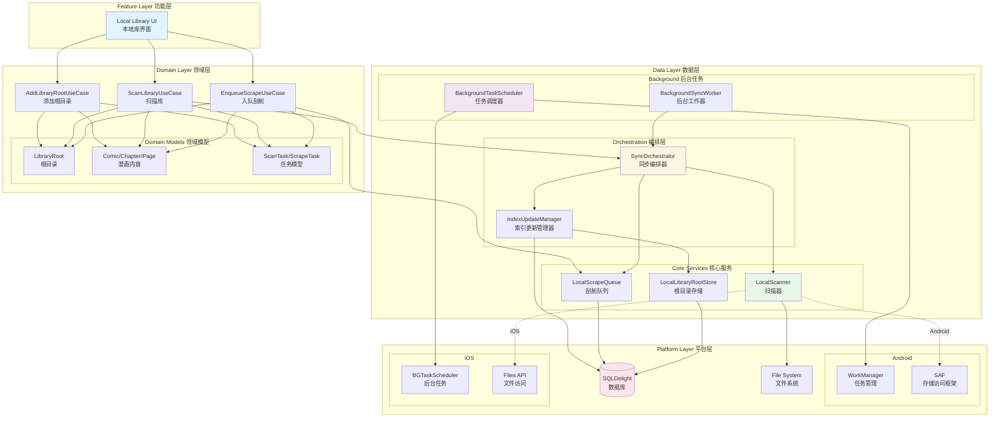

### 模块依赖关系

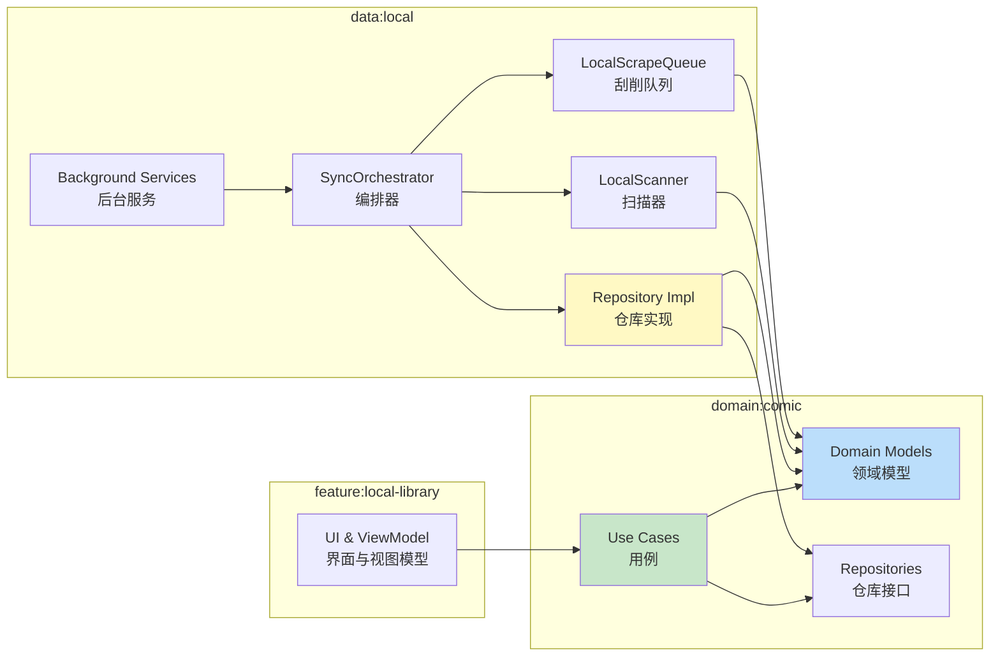

---

## 核心组件

### 1. LibraryRoot（库根目录）

代表一个本地漫画库的入口点，支持三种来源：

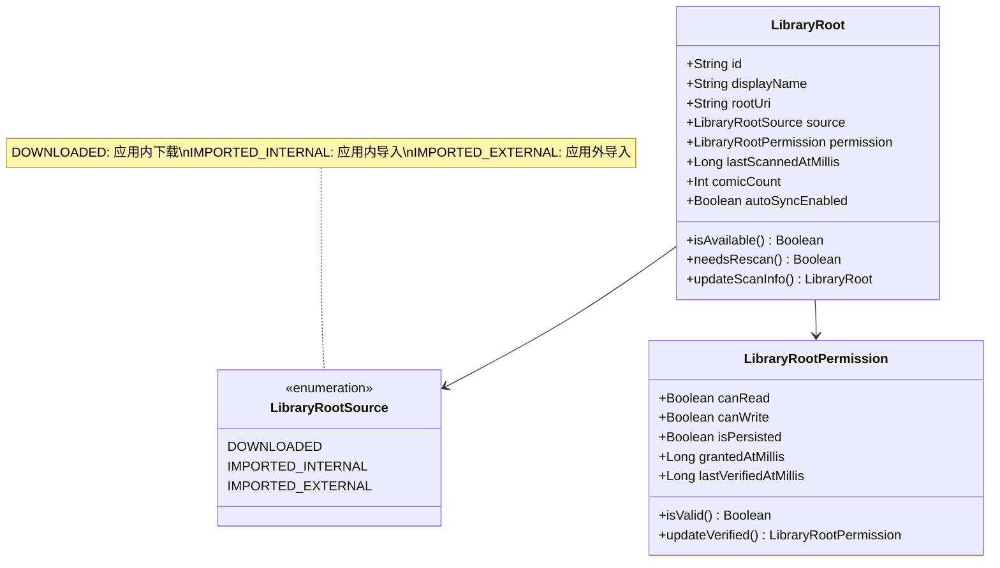

**三种来源的区别**：

| 来源 | 存储位置 | 权限控制 | 平台差异 |
|------|---------|---------|---------|
| **DOWNLOADED** | 应用私有目录 | 完全控制 | 无 |
| **IMPORTED_INTERNAL** | 应用私有目录 | 完全控制 | 无 |
| **IMPORTED_EXTERNAL** | 外部存储 | 需要授权 | Android: SAF<br/>iOS: Files |

### 2. SyncOrchestrator（同步编排器）

协调扫描-索引-刮削的完整流程：

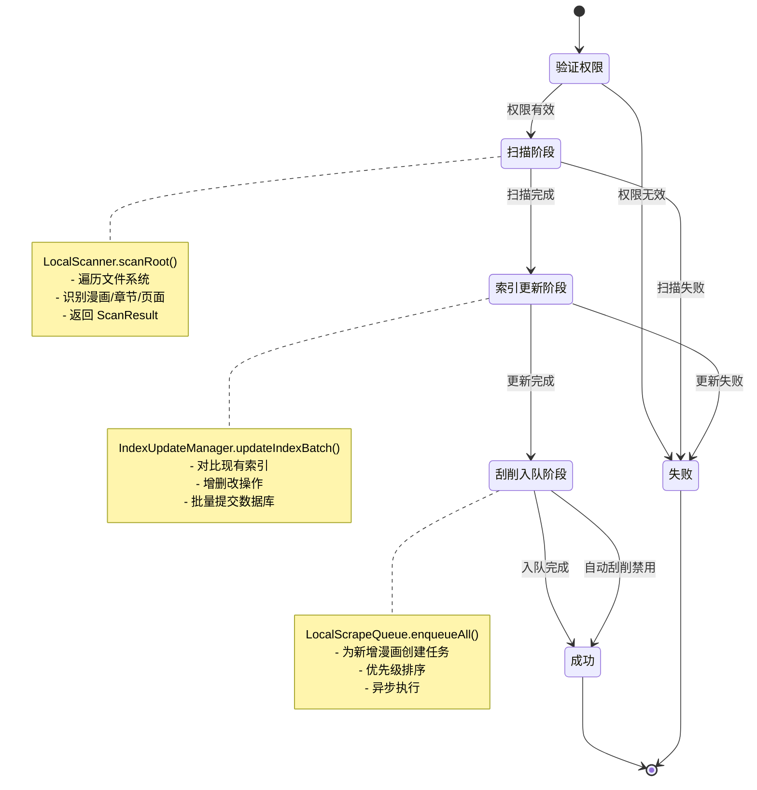

### 3. LocalScanner（本地扫描器）

识别文件系统中的漫画结构：

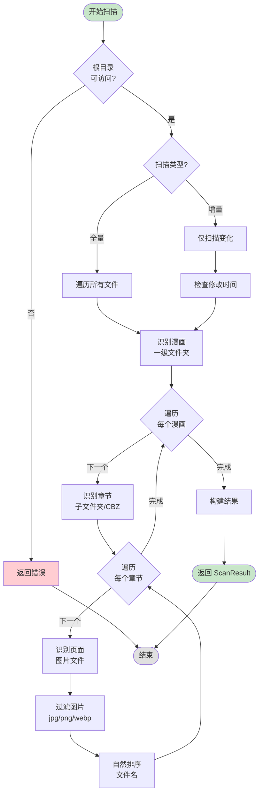

**扫描规则**：

1. **漫画识别**：根目录下的一级文件夹
2. **章节识别**：漫画文件夹下的子文件夹或 `.cbz` 文件
3. **页面识别**：章节内的图片文件（支持格式：jpg, jpeg, png, webp）
4. **排序规则**：按文件名自然排序（如：`001.jpg` < `002.jpg` < `10.jpg`）
5. **过滤规则**：忽略隐藏文件（`.` 开头）

### 4. IndexUpdateManager（索引更新管理器）

执行增量索引更新：

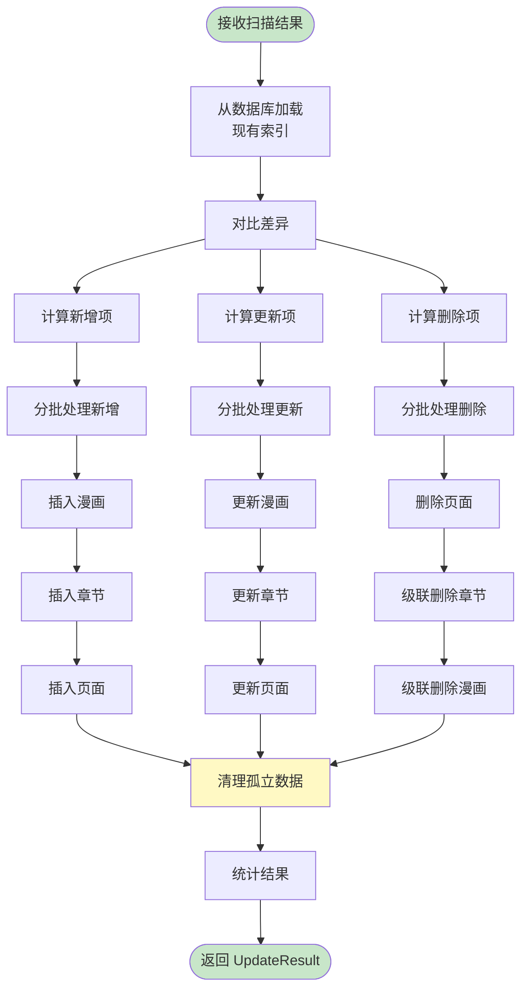

**更新策略**：

- **新增**：`scanned_uri` 在扫描结果中存在，但数据库中不存在
- **更新**：`scanned_uri` 在两边都存在，但 `updated_at` 不同
- **删除**：`db_uri` 在数据库中存在，但扫描结果中不存在

### 5. LocalScrapeQueue（刮削队列）

管理元数据获取任务：

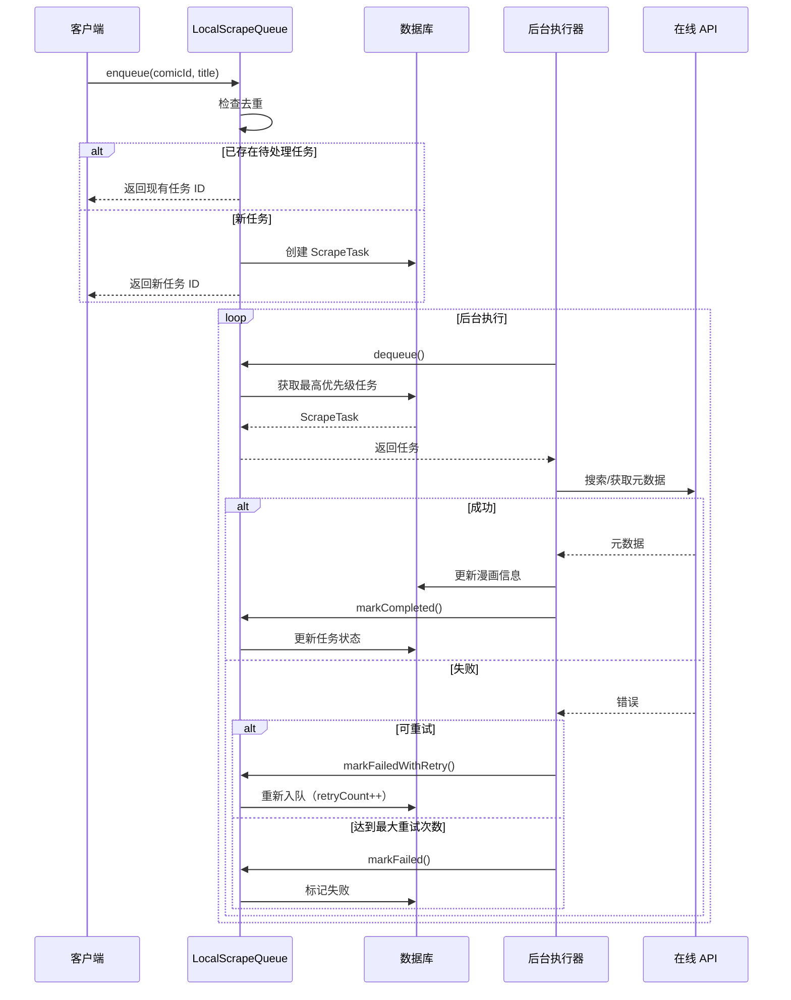

**任务优先级**：

1. **用户手动触发**：priority = 100
2. **新增漫画（自动）**：priority = 50
3. **重试任务**：priority = 原优先级 - 10

**重试策略**：

- 最大重试次数：3 次
- 失败后重新入队
- 每次重试降低优先级

---

## 数据流与流程

### 完整同步流程

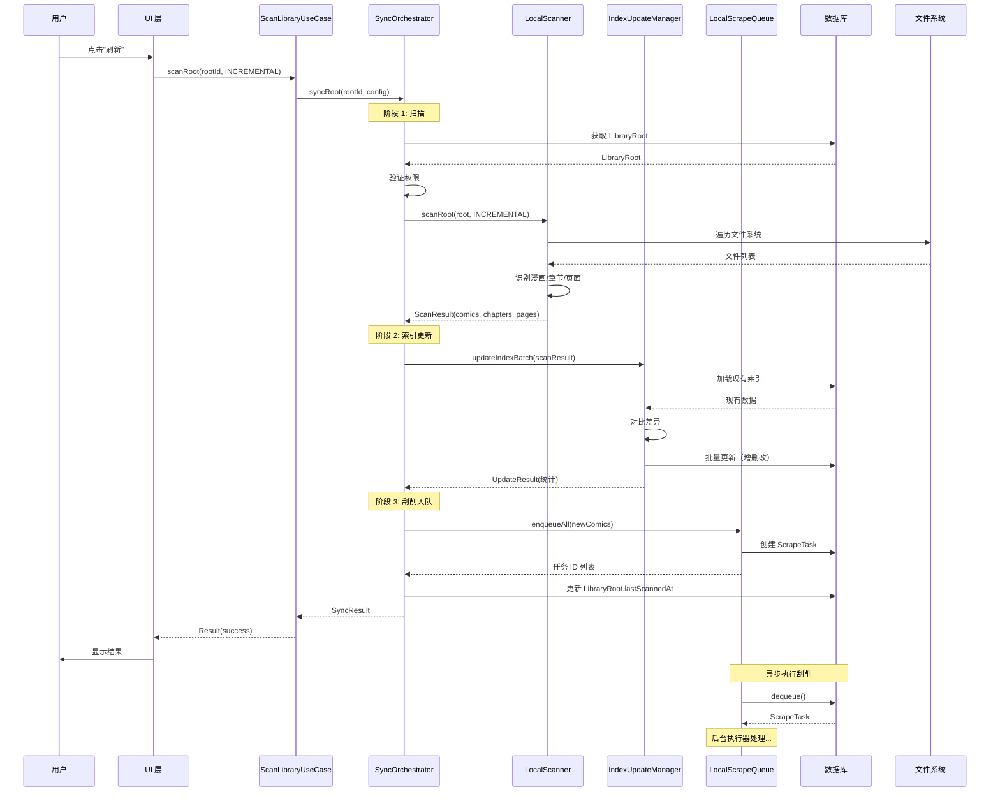

### 添加根目录流程

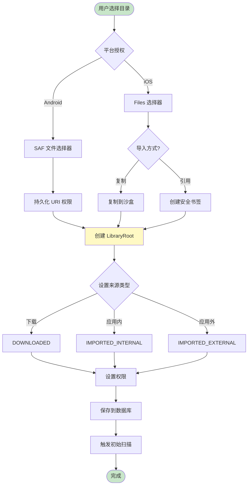

### 增量扫描优化流程

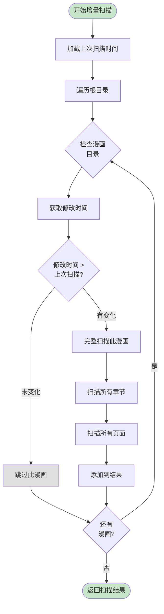

---

## 类图与关系

### 领域模型关系

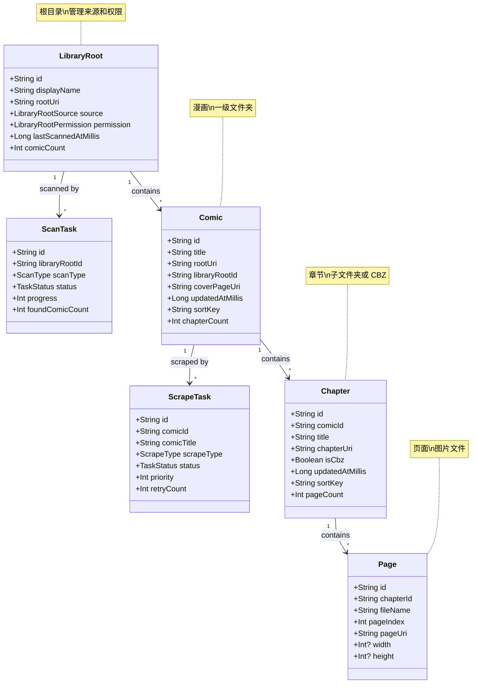

### 服务层关系

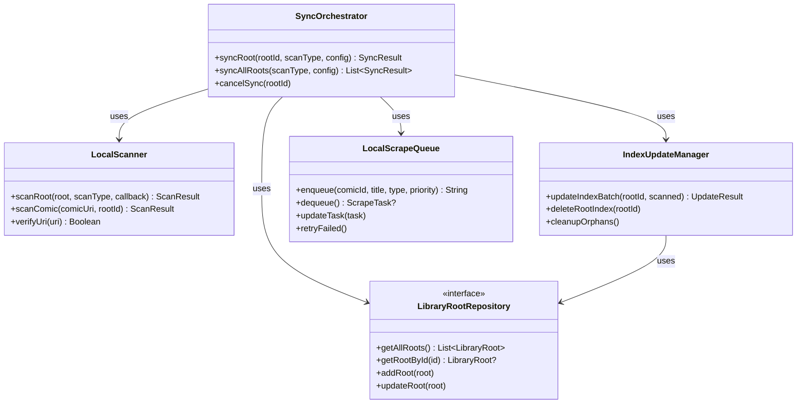

### 后台任务调度

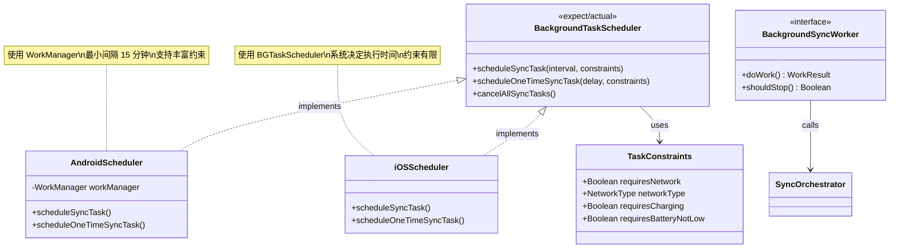

---

## 平台实现

### Android 平台特性

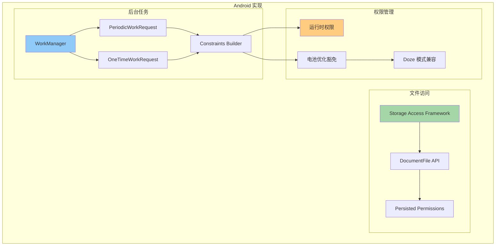

**关键实现点**：

1. **SAF 文件访问**：
   ```kotlin
   // 请求目录访问
   val intent = Intent(Intent.ACTION_OPEN_DOCUMENT_TREE)
   startActivityForResult(intent, REQUEST_CODE)
   
   // 持久化权限
   contentResolver.takePersistableUriPermission(
       uri,
       Intent.FLAG_GRANT_READ_URI_PERMISSION or
       Intent.FLAG_GRANT_WRITE_URI_PERMISSION
   )
   ```

2. **WorkManager 调度**：
   ```kotlin
   val workRequest = PeriodicWorkRequestBuilder<LocalSyncWorker>(
       1, TimeUnit.HOURS
   )
       .setConstraints(
           Constraints.Builder()
               .setRequiredNetworkType(NetworkType.CONNECTED)
               .setRequiresBatteryNotLow(true)
               .build()
       )
       .build()
   
   WorkManager.getInstance(context)
       .enqueueUniquePeriodicWork(
           "local_sync",
           ExistingPeriodicWorkPolicy.KEEP,
           workRequest
       )
   ```

### iOS 平台特性

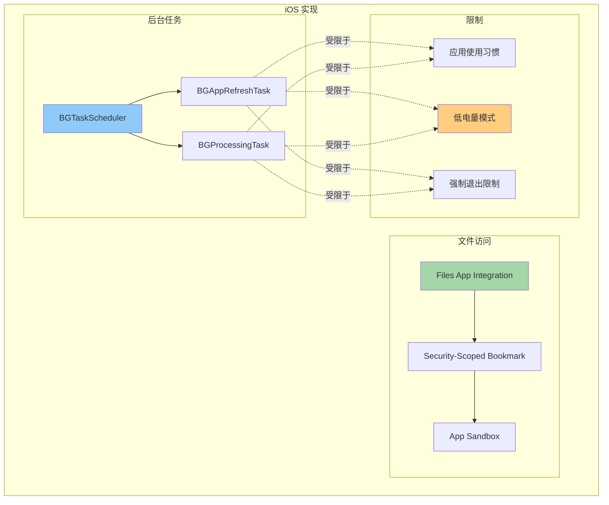

**关键实现点**：

1. **Files 集成**：
   ```swift
   // 文档选择器
   let picker = UIDocumentPickerViewController(
       forOpeningContentTypes: [.folder]
   )
   present(picker, animated: true)
   
   // 创建安全书签
   let bookmarkData = try url.bookmarkData(
       options: .minimalBookmark,
       includingResourceValuesForKeys: nil,
       relativeTo: nil
   )
   ```

2. **BGTaskScheduler**：
   ```swift
   // Info.plist 配置
   <key>BGTaskSchedulerPermittedIdentifiers</key>
   <array>
       <string>com.pusu.indexed.comics.refresh</string>
   </array>
   
   // 注册任务
   BGTaskScheduler.shared.register(
       forTaskWithIdentifier: "com.pusu.indexed.comics.refresh",
       using: nil
   ) { task in
       handleRefresh(task: task as! BGAppRefreshTask)
   }
   
   // 调度任务
   let request = BGAppRefreshTaskRequest(
       identifier: "com.pusu.indexed.comics.refresh"
   )
   request.earliestBeginDate = Date(timeIntervalSinceNow: 3600)
   try BGTaskScheduler.shared.submit(request)
   ```

---

## 使用示例

### 1. 添加根目录

```kotlin
// 用户选择目录后
val libraryRoot = LibraryRoot.createExternalImportedRoot(
    id = calculateUriHash(selectedUri),
    displayName = "我的漫画",
    rootUri = selectedUri,
    permission = LibraryRootPermission.externalGrant(
        canRead = true,
        canWrite = true,
        isPersisted = true
    )
)

// 添加到仓库
addLibraryRootUseCase(libraryRoot)

// 触发初始扫描
scanLibraryUseCase.scanRoot(
    libraryRootId = libraryRoot.id,
    scanType = ScanType.FULL
)
```

### 2. 手动刷新

```kotlin
// UI 层触发
viewModelScope.launch {
    _uiState.value = UiState.Loading
    
    val result = scanLibraryUseCase.scanRoot(
        libraryRootId = currentRootId,
        scanType = ScanType.INCREMENTAL
    )
    
    _uiState.value = when {
        result.success -> UiState.Success(
            newComics = result.newComicCount,
            updated = result.updatedComicCount
        )
        else -> UiState.Error(result.error ?: "未知错误")
    }
}
```

### 3. 配置自动同步

```kotlin
// 调度周期性任务
val scheduler = BackgroundTaskScheduler()
scheduler.scheduleSyncTask(
    intervalMinutes = 60, // 每小时
    constraints = TaskConstraints(
        requiresNetwork = false,
        requiresBatteryNotLow = true
    )
)

// 禁用某个根目录的自动同步
libraryRootRepository.updateRoot(
    currentRoot.copy(autoSyncEnabled = false)
)
```

### 4. 手动触发刮削

```kotlin
// 为单个漫画获取元数据
val taskId = enqueueScrapeUseCase.enqueueForComic(
    comicId = comic.id,
    comicTitle = comic.title,
    scrapeType = ScrapeType.FULL,
    priority = 100 // 高优先级
)

// 批量刮削
val comics = listOf(
    "comic1" to "标题1",
    "comic2" to "标题2"
)
enqueueScrapeUseCase.enqueueForComics(comics)
```

### 5. 监听同步进度

```kotlin
// 使用回调监听进度
val callback = object : SyncOrchestrator.SyncProgressCallback {
    override suspend fun onScanStarted(libraryRootId: String) {
        println("开始扫描: $libraryRootId")
    }
    
    override suspend fun onScanProgress(progress: Int, currentItem: String) {
        println("扫描进度: $progress% - $currentItem")
    }
    
    override suspend fun onIndexingStarted(totalItems: Int) {
        println("开始索引更新，共 $totalItems 项")
    }
    
    override suspend fun onIndexingProgress(processed: Int, total: Int) {
        println("索引进度: $processed/$total")
    }
    
    override suspend fun onScrapeStarted(taskCount: Int) {
        println("刮削任务已入队: $taskCount 个")
    }
    
    override suspend fun onSyncCompleted(result: SyncResult) {
        println("同步完成: 新增 ${result.newComicCount} 个漫画")
    }
    
    override suspend fun onSyncFailed(error: String) {
        println("同步失败: $error")
    }
}

// 执行同步
syncOrchestrator.syncRoot(
    libraryRootId = rootId,
    scanType = ScanType.INCREMENTAL,
    callback = callback
)
```

---

## 总结

本架构提供了完整的本地漫画库管理方案：

### ✅ 核心特性

1. **多来源支持**：下载、导入、外部存储
2. **智能扫描**：全量/增量、进度追踪
3. **自动索引**：增删改检测、批量更新
4. **元数据刮削**：优先级队列、自动重试
5. **后台同步**：跨平台调度、约束控制

### 📊 性能优化

- 增量扫描减少 I/O
- 批量提交避免频繁数据库操作
- 异步刮削不阻塞主流程
- 智能调度节省资源

### 🔧 可扩展性

- 清晰的分层架构
- 接口驱动设计
- 平台差异隔离
- 易于测试和维护

### 🎯 下一步

1. 实现平台特定代码（Android/iOS）
2. 集成 SQLDelight 数据库
3. 开发 UI 功能模块
4. 添加单元测试和集成测试
