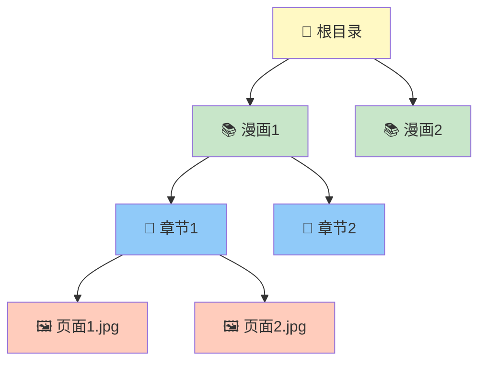
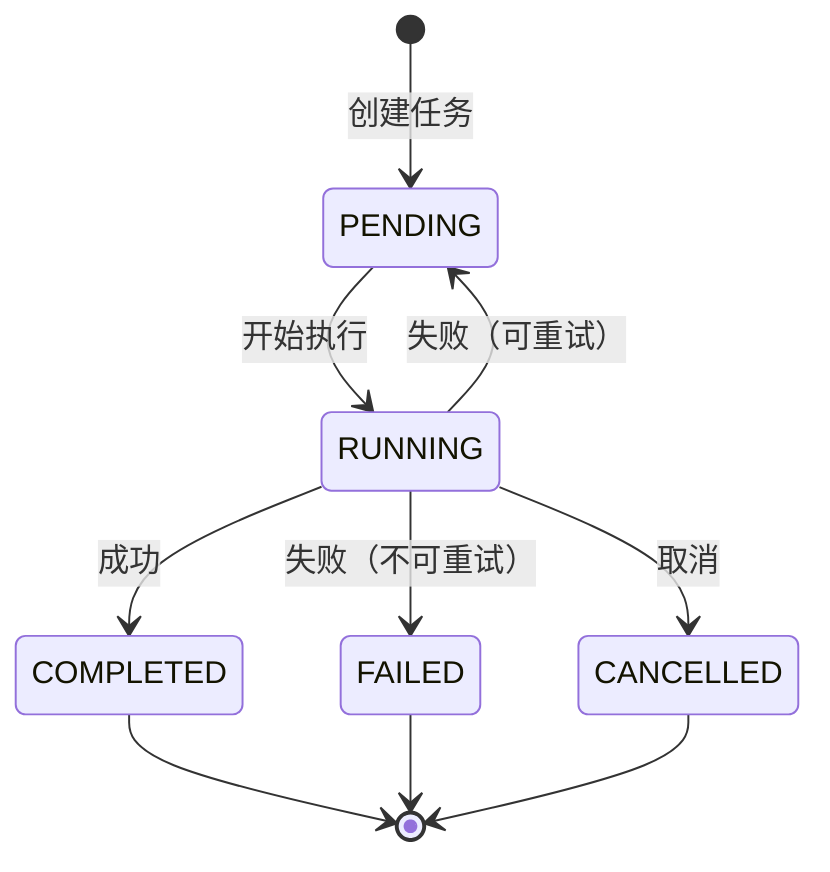

# 本地存储管理架构 - 快速参考

## 架构概览


## 核心流程：同步（5 步骤）


## 三种来源

| 来源 | 说明 | 权限 | 平台差异 |
|------|------|------|---------|
| 🔽 **DOWNLOADED** | 应用内下载 | 完全控制 | 无 |
| 📁 **IMPORTED_INTERNAL** | 应用内导入 | 完全控制 | 无 |
| 🌐 **IMPORTED_EXTERNAL** | 应用外导入 | 需授权 | Android: SAF<br/>iOS: Files |

## 扫描规则（3 层级）



- **漫画** = 一级文件夹
- **章节** = 子文件夹或 `.cbz` 文件
- **页面** = 图片文件（jpg/png/webp）

## 关键组件速查

| 组件 | 职责 | 输入 | 输出 |
|------|------|------|------|
| **LocalScanner** | 扫描文件系统 | LibraryRoot | ScanResult |
| **IndexUpdateManager** | 更新数据库 | ScanResult | UpdateResult |
| **LocalScrapeQueue** | 刮削队列 | ComicId + Title | TaskId |
| **SyncOrchestrator** | 协调流程 | RootId + Config | SyncResult |
| **BackgroundTaskScheduler** | 后台调度 | Interval + Constraints | - |

## 任务状态机



## 后台调度对比

| 特性 | Android | iOS |
|------|---------|-----|
| **API** | WorkManager | BGTaskScheduler |
| **最小间隔** | 15 分钟 | 无限制（系统决定） |
| **保证执行** | ✅ 是 | ⚠️ 尽力而为 |
| **约束条件** | 丰富 | 有限 |
| **周期性任务** | ✅ 原生支持 | ⚠️ 需手动重调度 |

## 典型使用场景

### 场景 1: 添加新目录

```kotlin
// 1. 创建根目录
val root = LibraryRoot.createExternalImportedRoot(...)

// 2. 保存
addLibraryRootUseCase(root)

// 3. 初始扫描
scanLibraryUseCase.scanRoot(root.id, ScanType.FULL)
```

### 场景 2: 手动刷新

```kotlin
// 增量扫描
val result = scanLibraryUseCase.scanRoot(
    libraryRootId = id,
    scanType = ScanType.INCREMENTAL
)

println("新增: ${result.newComicCount}, 更新: ${result.updatedComicCount}")
```

### 场景 3: 配置自动同步

```kotlin
// 每小时同步一次
BackgroundTaskScheduler().scheduleSyncTask(
    intervalMinutes = 60,
    constraints = TaskConstraints.DEFAULT
)
```

## 约束模板

| 模板 | 说明 | 网络 | 充电 | 电池 |
|------|------|------|------|------|
| **DEFAULT** | 常规同步 | 不需要 | 不需要 | 不低 |
| **RELAXED** | 尽快执行 | 不需要 | 不需要 | 不限 |
| **STRICT** | 严格条件 | Wi-Fi | 需要 | 不低 |
| **SCRAPING** | 刮削任务 | 需要 | 不需要 | 不低 |

## 性能优化建议

### ✅ 推荐做法

1. **优先增量扫描**：减少 I/O 和处理时间
2. **批量更新索引**：默认 50 条/批，避免内存溢出
3. **异步刮削**：不阻塞扫描和索引流程
4. **使用约束**：避免低电量时执行
5. **结合前台触发**：后台任务作为补充

### ❌ 避免做法

1. 频繁的全量扫描
2. 单条数据库插入
3. 同步执行刮削
4. 无约束的后台任务
5. 仅依赖后台任务（iOS 不可靠）

## 文件结构示例

```
📂 我的漫画/                    <- LibraryRoot
├── 📚 海贼王/                   <- Comic
│   ├── 📖 第001话/              <- Chapter
│   │   ├── 🖼️ 001.jpg         <- Page
│   │   ├── 🖼️ 002.jpg
│   │   └── 🖼️ 003.jpg
│   ├── 📖 第002话/
│   │   └── ...
│   └── 📖 第003话.cbz          <- Chapter (CBZ)
├── 📚 火影忍者/
│   └── ...
└── 📚 龙珠/
    └── ...
```

## 数据库表关系

```
LibraryRoots (根目录)
    ↓ 1:N
Comics (漫画)
    ↓ 1:N
Chapters (章节)
    ↓ 1:N
Pages (页面)
```

**约束**：
- `Comics.root_uri` UNIQUE
- `Chapters.chapter_uri` UNIQUE
- `Pages.page_uri` UNIQUE
- 级联删除：删除漫画 → 自动删除章节和页面

## 错误处理策略

| 错误类型 | 处理方式 |
|---------|---------|
| **权限丢失** | 通知用户重新授权 |
| **文件读取失败** | 跳过该文件，记录日志 |
| **数据库错误** | 回滚事务，返回错误 |
| **网络失败** | 重试（最多 3 次） |
| **扫描超时** | 取消扫描，保留已处理部分 |

## 调试命令

### Android

```bash
# 查看已调度任务
adb shell dumpsys jobscheduler | grep Cooomics

# 触发 WorkManager 任务
adb shell am broadcast -a "androidx.work.diagnostics.REQUEST_DIAGNOSTICS"
```

### iOS

```bash
# 模拟后台任务启动
e -l objc -- (void)[[BGTaskScheduler sharedScheduler] \
  _simulateLaunchForTaskWithIdentifier:@"com.pusu.indexed.comics.refresh"]
```

## 相关文档

- 📄 [完整架构文档](./local_storage_architecture.md) - 详细的设计和流程图
- 📄 [后台调度文档](../Cooomics/data/local/BACKGROUND_SCHEDULING.md) - 平台实现细节
- 📄 [同步流程文档](../Cooomics/data/local/SYNC_FLOW.md) - 任务编排详解
- 📄 [本地漫画设计](./local_comics_design.md) - 文件格式规范
- 📄 [索引缓存设计](./local_cache_sync.md) - 数据库结构

## 模块路径

```
Cooomics/
├── domain/comic/              # 领域模型和用例
│   └── src/commonMain/kotlin/com/pusu/indexed/domain/comic/
│       ├── model/             # LibraryRoot, Comic, Chapter, Page
│       ├── repository/        # 仓库接口
│       └── usecase/          # 用例
│
└── data/local/               # 数据层实现
    └── src/
        ├── commonMain/kotlin/com/pusu/indexed/data/local/
        │   ├── scanner/       # LocalScanner
        │   ├── scrape/        # LocalScrapeQueue
        │   ├── orchestrator/  # SyncOrchestrator, IndexUpdateManager
        │   ├── store/         # LocalLibraryRootStore
        │   └── background/    # BackgroundTaskScheduler (expect)
        ├── androidMain/       # Android 实现 (actual)
        └── iosMain/          # iOS 实现 (actual)
```

## 快速开始检查清单

- [ ] 添加 SQLDelight 依赖和表定义
- [ ] 实现平台特定的文件扫描器
- [ ] 实现 Android WorkManager Worker
- [ ] 实现 iOS BGTaskScheduler 注册
- [ ] 创建 UI 模块（feature:local-library）
- [ ] 添加根目录管理界面
- [ ] 实现漫画列表和阅读器
- [ ] 添加单元测试
- [ ] 添加集成测试
- [ ] 性能测试（大型库）
