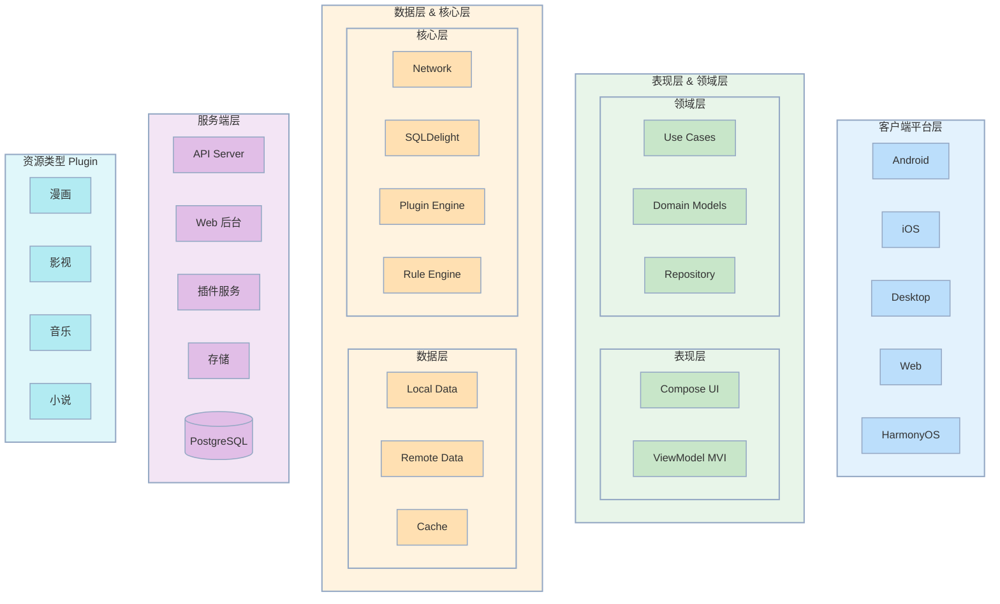
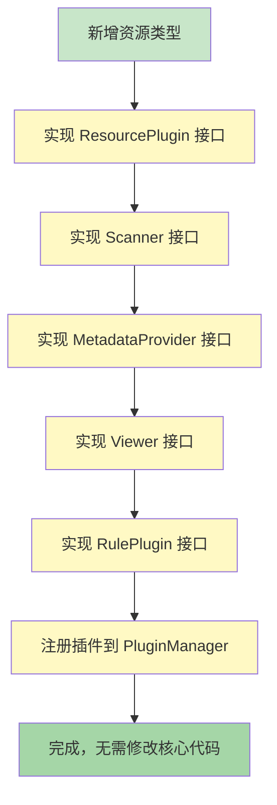
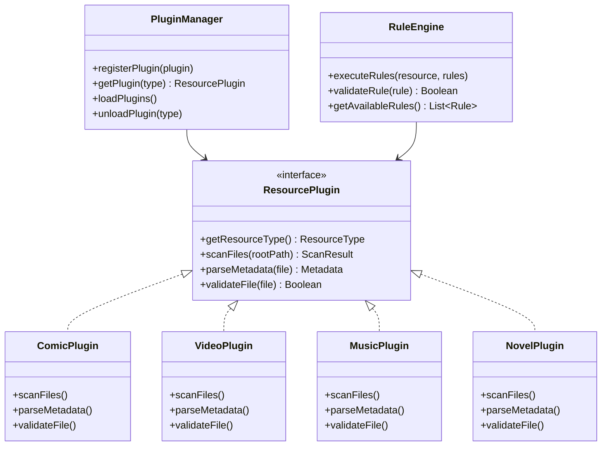
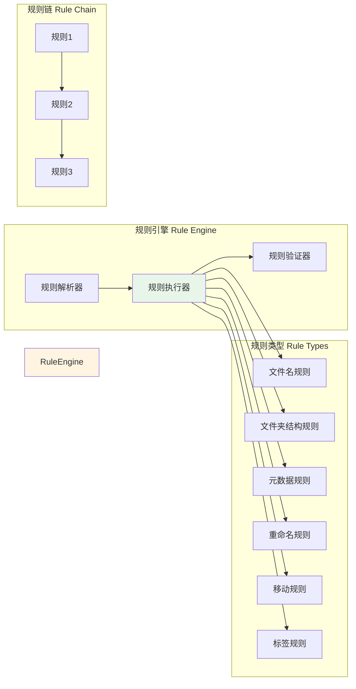
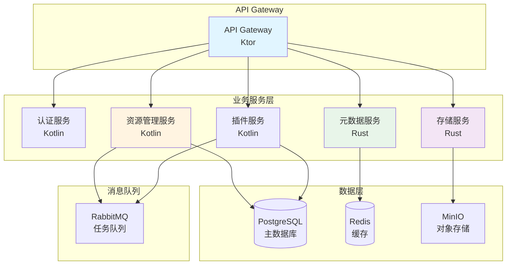
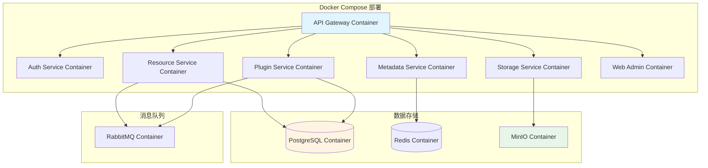

# Indexed 架构设计文档

## 整体架构概览

系统模块结构图（按分层划分，层名在左，同层模块横向排列，层间纵向连接）：



### 模块结构

```
Cooomics/
├── core/                          # 核心基础设施层
│   ├── base/                      # 基础类和扩展
│   ├── network/                   # 网络层
│   ├── database/                   # 数据库层
│   ├── di/                        # 依赖注入
│   └── design/                    # 设计系统
│
├── platform/                     # 平台能力抽象层
│   ├── file/                      # 文件系统抽象（expect/actual）
│   ├── storage/                    # 存储访问抽象
│   ├── background/                 # 后台任务抽象
│   └── media/                      # 媒体能力抽象（播放、解码等）
│
├── resource/                      # 统一资源抽象层（核心）
│   ├── model/                      # 资源模型接口
│   │   ├── Resource.kt            # 资源基类接口
│   │   ├── ResourceMetadata.kt    # 元数据接口
│   │   ├── ResourceFile.kt        # 资源文件接口
│   │   └── ResourceType.kt        # 资源类型枚举
│   │
│   ├── scanner/                    # 统一扫描抽象
│   │   ├── ResourceScanner.kt     # 扫描器接口
│   │   ├── ScanResult.kt          # 扫描结果模型
│   │   └── ScanConfig.kt          # 扫描配置
│   │
│   ├── indexer/                   # 统一索引抽象
│   │   ├── ResourceIndexer.kt     # 索引器接口
│   │   ├── IndexUpdateManager.kt  # 索引更新管理器
│   │   └── IndexStrategy.kt       # 索引策略
│   │
│   ├── metadata/                  # 统一元数据抽象
│   │   ├── MetadataProvider.kt    # 元数据提供者接口
│   │   ├── MetadataScraper.kt     # 元数据刮削器接口
│   │   └── MetadataCache.kt       # 元数据缓存
│   │
│   ├── viewer/                    # 统一查看器抽象
│   │   ├── ResourceViewer.kt     # 查看器接口
│   │   ├── ViewerState.kt         # 查看器状态
│   │   └── ViewerConfig.kt        # 查看器配置
│   │
│   ├── repository/                # 资源仓库接口
│   │   ├── ResourceRepository.kt  # 统一资源仓库
│   │   └── LibraryRootRepository.kt # 库根目录仓库
│   │
│   └── usecase/                   # 资源用例（统一）
│       ├── ScanResourceUseCase.kt      # 扫描资源
│       ├── IndexResourceUseCase.kt     # 索引资源
│       ├── ScrapeMetadataUseCase.kt    # 刮削元数据
│       ├── ViewResourceUseCase.kt      # 查看资源
│       └── OrganizeResourceUseCase.kt  # 整理资源
│
├── plugin/                        # 插件系统（基础设施）
│   ├── core/                      # 插件核心
│   │   ├── PluginManager.kt      # 插件管理器
│   │   ├── PluginLoader.kt        # 插件加载器
│   │   ├── PluginRegistry.kt      # 插件注册表
│   │   └── PluginInterface.kt     # 插件接口定义
│   │
│   ├── rule/                      # 规则引擎
│   │   ├── RuleEngine.kt           # 规则引擎
│   │   ├── RuleParser.kt          # 规则解析器
│   │   ├── RuleExecutor.kt        # 规则执行器
│   │   └── RuleTemplate.kt       # 规则模板
│   │
│   └── sdk/                       # 插件开发 SDK
│       ├── ResourcePluginBase.kt # 资源插件基类
│       ├── RulePluginBase.kt      # 规则插件基类
│       └── MetadataPluginBase.kt  # 元数据插件基类
│
├── plugin-impl/                   # 插件实现（各资源类型）
│   ├── comic/                     # 漫画插件
│   │   ├── ComicResourcePlugin.kt      # 漫画资源插件
│   │   ├── ComicScanner.kt             # 漫画扫描器
│   │   ├── ComicMetadataProvider.kt    # 漫画元数据提供者
│   │   ├── ComicViewer.kt              # 漫画查看器
│   │   └── ComicRulePlugin.kt          # 漫画规则插件
│   │
│   ├── video/                     # 影视插件
│   │   ├── VideoResourcePlugin.kt
│   │   ├── VideoScanner.kt
│   │   ├── VideoMetadataProvider.kt
│   │   ├── VideoViewer.kt
│   │   └── VideoRulePlugin.kt
│   │
│   ├── music/                     # 音乐插件
│   │   ├── MusicResourcePlugin.kt
│   │   ├── MusicScanner.kt
│   │   ├── MusicMetadataProvider.kt
│   │   ├── MusicViewer.kt
│   │   └── MusicRulePlugin.kt
│   │
│   └── novel/                     # 小说插件
│       ├── NovelResourcePlugin.kt
│       ├── NovelScanner.kt
│       ├── NovelMetadataProvider.kt
│       ├── NovelViewer.kt
│       └── NovelRulePlugin.kt
│
├── data/                          # 数据层（统一实现）
│   ├── local/                     # 本地数据源
│   │   ├── LocalResourceStore.kt  # 本地资源存储
│   │   ├── LocalIndexStore.kt     # 本地索引存储
│   │   └── LocalMetadataStore.kt  # 本地元数据存储
│   │
│   ├── remote/                    # 远程数据源
│   │   ├── RemoteResourceStore.kt # 远程资源存储
│   │   └── RemoteMetadataStore.kt # 远程元数据存储
│   │
│   └── cache/                     # 缓存层
│       ├── ResourceCache.kt       # 资源缓存
│       └── MetadataCache.kt       # 元数据缓存
│
├── feature/                       # 功能模块层（统一 UI）
│   ├── library/                   # 资源库（统一）
│   │   ├── LibraryScreen.kt       # 资源库界面
│   │   ├── ResourceList.kt        # 资源列表组件
│   │   ├── ResourceCard.kt       # 资源卡片组件
│   │   └── LibraryViewModel.kt    # 资源库视图模型
│   │
│   ├── viewer/                    # 查看器（统一）
│   │   ├── ResourceViewerScreen.kt # 查看器界面
│   │   ├── ViewerControls.kt      # 查看器控制组件
│   │   └── ViewerViewModel.kt     # 查看器视图模型
│   │
│   ├── scanner/                   # 扫描管理
│   │   ├── ScannerScreen.kt       # 扫描界面
│   │   └── ScannerViewModel.kt    # 扫描视图模型
│   │
│   ├── organizer/                # 整理管理
│   │   ├── OrganizerScreen.kt     # 整理界面
│   │   └── OrganizerViewModel.kt  # 整理视图模型
│   │
│   └── settings/                 # 设置
│       ├── SettingsScreen.kt
│       └── SettingsViewModel.kt
│
└── app/                           # 应用主模块
    ├── navigation/                # 导航
    ├── di/                        # 依赖注入配置
    └── App.kt                     # 应用入口
```

### 设计理念说明

#### 1. 统一资源抽象层（resource/）
**核心理念**：所有资源类型共享统一的抽象接口和公共能力

- **model/**：定义资源、元数据、文件的统一接口，所有资源类型必须实现
- **scanner/**：统一的扫描抽象，各资源插件实现具体扫描逻辑
- **indexer/**：统一的索引抽象，支持所有资源类型的索引管理
- **metadata/**：统一的元数据抽象，支持多种元数据源
- **viewer/**：统一的查看器抽象，各资源插件实现具体查看逻辑
- **repository/**：统一的资源仓库接口，屏蔽资源类型差异
- **usecase/**：统一的业务用例，所有资源类型共享相同的业务流程

**优势**：
- 代码复用：公共能力只需实现一次
- 一致性：所有资源类型遵循相同的接口规范
- 可扩展性：新增资源类型只需实现插件，无需修改核心代码

#### 2. 插件系统（plugin/）
**核心理念**：插件系统是基础设施，所有资源类型通过插件实现

- **core/**：插件管理、加载、注册的核心机制
- **rule/**：规则引擎，支持跨资源类型的规则定义和执行
- **sdk/**：插件开发 SDK，提供插件开发的基础类和工具

**优势**：
- 解耦：资源类型实现与核心系统解耦
- 动态加载：支持插件的动态加载和卸载
- 生态：支持第三方插件开发

#### 3. 插件实现（plugin-impl/）
**核心理念**：各资源类型作为独立插件实现，实现统一的资源抽象接口

每个资源插件包含：
- **ResourcePlugin**：实现资源识别、扫描等核心功能
- **Scanner**：实现该资源类型的扫描逻辑
- **MetadataProvider**：实现该资源类型的元数据获取
- **Viewer**：实现该资源类型的查看/播放逻辑
- **RulePlugin**：实现该资源类型的特定规则

**优势**：
- 模块化：每个资源类型独立开发和维护
- 可替换：可以替换或升级单个插件而不影响其他资源类型
- 可扩展：新增资源类型只需添加新插件

#### 4. 统一功能模块（feature/）
**核心理念**：UI 层不区分资源类型，统一展示和管理

- **library/**：统一的资源库界面，展示所有类型的资源
- **viewer/**：统一的查看器框架，根据资源类型加载对应插件
- **scanner/**：统一的扫描管理，支持所有资源类型
- **organizer/**：统一的整理管理，使用规则引擎

**优势**：
- 用户体验一致：所有资源类型使用相同的界面和交互
- 代码复用：UI 组件只需实现一次
- 易于维护：统一的 UI 逻辑，减少重复代码

#### 5. 平台能力抽象（platform/）
**核心理念**：平台差异通过 expect/actual 机制隔离

- **file/**：文件系统访问抽象
- **storage/**：存储访问抽象
- **background/**：后台任务抽象
- **media/**：媒体能力抽象（播放、解码等）

**优势**：
- 跨平台：核心代码不依赖平台特定 API
- 可测试：平台能力可以 mock，便于单元测试

### 架构对比：旧架构 vs 新架构

#### 旧架构问题
```
domain/
├── comic/          # 漫画领域（独立实现）
├── video/          # 影视领域（独立实现）
├── music/          # 音乐领域（独立实现）
└── novel/          # 小说领域（独立实现）
```
**问题**：
- ❌ 每个资源类型独立实现，代码重复
- ❌ 公共能力（扫描、索引、元数据）分散在各领域
- ❌ 新增资源类型需要修改多处代码
- ❌ UI 层需要为每个资源类型单独实现

#### 新架构优势
```
resource/           # 统一资源抽象（公共能力）
├── scanner/        # 统一扫描抽象
├── indexer/        # 统一索引抽象
├── metadata/       # 统一元数据抽象
└── viewer/         # 统一查看器抽象

plugin-impl/        # 插件实现（各资源类型）
├── comic/          # 漫画插件（实现统一接口）
├── video/          # 影视插件（实现统一接口）
├── music/          # 音乐插件（实现统一接口）
└── novel/          # 小说插件（实现统一接口）
```
**优势**：
- ✅ 公共能力统一抽象，代码复用
- ✅ 各资源类型通过插件实现，解耦
- ✅ 新增资源类型只需添加插件，无需修改核心代码
- ✅ UI 层统一实现，根据资源类型动态加载插件

### 资源类型扩展流程



**关键点**：
- 所有接口都在 `resource/` 层定义
- 插件只需实现接口，无需了解核心实现
- 核心系统通过插件管理器加载插件
- UI 层通过统一接口访问，自动适配不同资源类型

---

## 插件化架构设计

### 插件系统核心



### 插件接口定义

```kotlin
/**
 * 资源插件接口
 * 所有资源类型插件必须实现此接口
 */
interface ResourcePlugin {
    /**
     * 资源类型标识
     */
    val resourceType: ResourceType
    
    /**
     * 扫描文件系统，识别资源
     */
    suspend fun scanFiles(
        rootPath: String,
        config: ScanConfig
    ): ScanResult
    
    /**
     * 解析文件元数据
     */
    suspend fun parseMetadata(
        file: ResourceFile
    ): ResourceMetadata
    
    /**
     * 验证文件是否符合资源类型
     */
    fun validateFile(file: File): Boolean
    
    /**
     * 获取支持的文件扩展名
     */
    fun getSupportedExtensions(): List<String>
    
    /**
     * 获取资源整理规则模板
     */
    fun getRuleTemplates(): List<RuleTemplate>
}

/**
 * 资源类型枚举
 */
enum class ResourceType {
    COMIC,      // 漫画
    VIDEO,      // 影视
    MUSIC,      // 音乐
    NOVEL       // 小说
}
```

### 规则引擎设计



### 规则定义示例

```kotlin
/**
 * 规则接口
 */
interface Rule {
    val id: String
    val name: String
    val description: String
    val priority: Int
    
    /**
     * 执行规则
     */
    suspend fun execute(context: RuleContext): RuleResult
}

/**
 * 规则上下文
 */
data class RuleContext(
    val resource: Resource,
    val file: ResourceFile,
    val metadata: ResourceMetadata?,
    val config: RuleConfig
)

/**
 * 规则配置示例：文件名规则
 */
data class FileNameRuleConfig(
    val pattern: String,           // 正则表达式模式
    val targetFormat: String,      // 目标格式
    val extractGroups: List<Int>   // 提取的组
) : RuleConfig

/**
 * 规则配置示例：文件夹结构规则
 */
data class FolderStructureRuleConfig(
    val structure: FolderStructure, // 文件夹结构定义
    val autoCreate: Boolean         // 是否自动创建
) : RuleConfig
```

---

## 服务端架构

### 服务端整体架构



### 服务端模块划分

```
server/
├── api-gateway/                  # API 网关（Kotlin + Ktor）
│   ├── routes/                   # 路由定义
│   ├── middleware/               # 中间件
│   └── filters/                  # 过滤器
│
├── services/                     # 业务服务
│   ├── auth-service/             # 认证服务（Kotlin）
│   ├── resource-service/         # 资源管理服务（Kotlin）
│   ├── plugin-service/           # 插件服务（Kotlin）
│   ├── metadata-service/         # 元数据服务（Rust）
│   └── storage-service/          # 存储服务（Rust）
│
├── shared/                       # 共享代码
│   ├── models/                   # 数据模型
│   ├── protocols/                # 协议定义
│   └── utils/                    # 工具类
│
├── web-admin/                    # Web 后台管理（React/Vue）
│   ├── src/
│   │   ├── pages/                # 页面
│   │   ├── components/            # 组件
│   │   └── api/                   # API 客户端
│   └── public/
│
└── docker/                       # Docker 配置
    ├── docker-compose.yml
    └── Dockerfile.*
```

### API 设计

```kotlin
/**
 * RESTful API 设计
 */

// 资源管理 API
GET    /api/v1/resources              // 获取资源列表
GET    /api/v1/resources/{id}         // 获取资源详情
POST   /api/v1/resources              // 创建资源
PUT    /api/v1/resources/{id}         // 更新资源
DELETE /api/v1/resources/{id}          // 删除资源

// 扫描任务 API
POST   /api/v1/scan/tasks              // 创建扫描任务
GET    /api/v1/scan/tasks/{id}         // 获取任务状态
GET    /api/v1/scan/tasks              // 获取任务列表

// 插件管理 API
GET    /api/v1/plugins                 // 获取插件列表
POST   /api/v1/plugins                 // 安装插件
DELETE /api/v1/plugins/{id}            // 卸载插件

// 规则管理 API
GET    /api/v1/rules                   // 获取规则列表
POST   /api/v1/rules                   // 创建规则
PUT    /api/v1/rules/{id}              // 更新规则
DELETE /api/v1/rules/{id}              // 删除规则

// WebSocket API
WS     /ws/scan/progress               // 扫描进度推送
WS     /ws/task/status                 // 任务状态推送
```

---

## 数据模型设计

### 资源抽象模型

```kotlin
/**
 * 资源基类
 */
sealed class Resource {
    abstract val id: String
    abstract val type: ResourceType
    abstract val title: String
    abstract val metadata: ResourceMetadata
    abstract val files: List<ResourceFile>
    abstract val createdAt: Long
    abstract val updatedAt: Long
}

/**
 * 资源元数据
 */
interface ResourceMetadata {
    val title: String?
    val description: String?
    val tags: List<String>
    val cover: String?
    val year: Int?
    val rating: Float?
    val customFields: Map<String, Any>
}

/**
 * 资源文件
 */
data class ResourceFile(
    val id: String,
    val path: String,
    val name: String,
    val size: Long,
    val mimeType: String,
    val checksum: String?,
    val metadata: Map<String, Any>
)
```

### 数据库设计

```sql
-- 资源表（通用）
CREATE TABLE resources (
    id VARCHAR(255) PRIMARY KEY,
    type VARCHAR(50) NOT NULL,
    title VARCHAR(500) NOT NULL,
    metadata JSONB,
    created_at BIGINT NOT NULL,
    updated_at BIGINT NOT NULL,
    INDEX idx_type (type),
    INDEX idx_title (title)
);

-- 资源文件表
CREATE TABLE resource_files (
    id VARCHAR(255) PRIMARY KEY,
    resource_id VARCHAR(255) NOT NULL,
    path VARCHAR(1000) NOT NULL,
    name VARCHAR(500) NOT NULL,
    size BIGINT NOT NULL,
    mime_type VARCHAR(100),
    checksum VARCHAR(64),
    metadata JSONB,
    FOREIGN KEY (resource_id) REFERENCES resources(id) ON DELETE CASCADE,
    INDEX idx_resource_id (resource_id)
);

-- 扫描任务表
CREATE TABLE scan_tasks (
    id VARCHAR(255) PRIMARY KEY,
    resource_type VARCHAR(50) NOT NULL,
    root_path VARCHAR(1000) NOT NULL,
    status VARCHAR(50) NOT NULL,
    progress INT DEFAULT 0,
    result JSONB,
    created_at BIGINT NOT NULL,
    updated_at BIGINT NOT NULL,
    INDEX idx_status (status)
);

-- 规则表
CREATE TABLE rules (
    id VARCHAR(255) PRIMARY KEY,
    resource_type VARCHAR(50) NOT NULL,
    name VARCHAR(200) NOT NULL,
    config JSONB NOT NULL,
    priority INT DEFAULT 0,
    enabled BOOLEAN DEFAULT TRUE,
    created_at BIGINT NOT NULL,
    updated_at BIGINT NOT NULL,
    INDEX idx_resource_type (resource_type)
);
```

---

## 部署架构

### 客户端部署

- **Android**: Google Play / 直接安装 APK
- **iOS**: App Store / TestFlight
- **Desktop**: 官网下载 / 包管理器
- **Web**: 静态托管 / CDN
- **HarmonyOS**: 应用市场

### 服务端部署



---

## 安全设计

### 认证和授权

- **JWT Token** 认证
- **RBAC** 角色权限控制
- **API Key** 服务端访问
- **OAuth2** 第三方登录（可选）

### 数据安全

- **TLS/SSL** 加密传输
- **数据加密** 敏感数据加密存储
- **访问控制** 文件访问权限控制
- **审计日志** 操作日志记录

---

## 性能优化

### 客户端优化

- 增量扫描和更新
- 智能缓存策略
- 后台任务优化
- 图片懒加载和压缩

### 服务端优化

- 数据库索引优化
- Redis 缓存热点数据
- 异步任务处理
- CDN 加速静态资源

---

**最后更新**：2026-01-27  
**版本**：1.0.0
