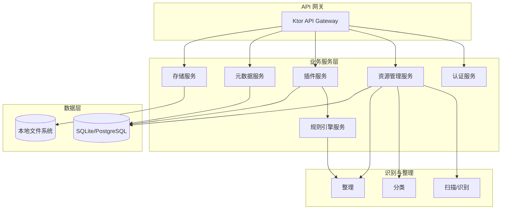

# 服务端架构设计

依据 [产品立项说明](./00_project_overview.md)：服务端负责**资源识别、分类、整理**，以及**存储资源与元数据**。客户端与自部署服务端配套使用，资源存于服务端。本文档按**个人本地部署**场景设计，不依赖 Redis、对象存储等额外中间件。

---

## 系统模块结构图

---

## 模块说明

| 模块 | 职责 |
|------|------|
| **API 网关** | 路由、鉴权、协议统一 |
| **认证服务** | 用户/Token 认证、权限校验（单用户可简化） |
| **资源管理服务** | 资源 CRUD、列表/详情、与识别/整理流程编排 |
| **插件服务** | 插件注册、加载、配置；资源类型扩展 |
| **规则引擎服务** | 规则配置执行、分类与整理策略 |
| **元数据服务** | 元数据刮削、写入数据库；热点可内存缓存，无需独立缓存服务 |
| **存储服务** | 文件上传/下载、读写本地库根目录（文件系统） |
| **扫描/识别** | 根据资源类型识别文件、生成资源记录 |
| **分类/整理** | 按规则分类、重命名、归档等 |

---

## 技术选型（个人本地部署）

| 类别 | 选型 | 说明 |
|------|------|------|
| **API 框架** | Ktor (Kotlin) | 异步、轻量、易与 Kotlin 生态集成 |
| **业务语言** | Kotlin | 与客户端共享模型与协议 |
| **数据库** | SQLite（推荐）/ PostgreSQL | 单机推荐 SQLite，单文件、零运维；资源/元数据/规则/任务均落库 |
| **资源文件存储** | 本地文件系统 | 指定库根目录，上传与整理结果直接读写目录，无需对象存储 |
| **异步任务** | 进程内协程/线程池 | 扫描、刮削、整理在进程内异步执行，无需 RabbitMQ/Redis |
| **部署** | 单进程 / Docker（可选） | 本地单进程即可；需要时可 Docker 打包 |

---

## 与客户端、后台的边界

- **对客户端**：提供 REST/WebSocket API，用于上传资源、拉取资源列表与详情、同步状态；不承担 UI 与本地扫描逻辑。
- **对后台**：提供配置类 API（规则、插件、元数据源等），由后台调用并持久化到服务端存储。

---

**最后更新**：2026-01-30 · 版本 1.0.0
