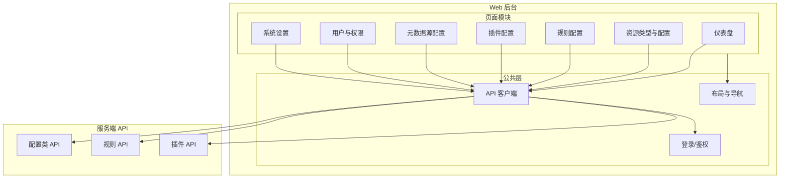

# 后台架构设计

依据 [产品立项说明](./00_project_overview.md)：**后台**面向管理者，用于**定义全部配置**（规则、插件、元数据等）。仅 Web 端提供后台能力。

---

## 系统模块结构图

---

## 模块说明

| 模块 | 职责 |
|------|------|
| **仪表盘** | 概览：资源统计、任务状态、系统健康 |
| **资源类型与配置** | 管理资源类型（含自定义类型）、默认规则与展示配置 |
| **规则配置** | 规则的新增/编辑/启用/禁用、优先级、作用范围 |
| **插件配置** | 插件安装/卸载、参数配置、启用状态 |
| **元数据源配置** | 元数据源（如 TMDB、豆瓣等）的启用与密钥配置 |
| **用户与权限** | 管理者账号、角色与权限（若多用户） |
| **系统设置** | 存储、队列、网络等基础配置的查看与修改 |
| **API 客户端** | 封装对服务端配置类 API 的调用 |
| **登录/鉴权** | 后台登录、Token 刷新、请求头注入 |

---

## 技术选型

| 类别 | 选型 | 说明 |
|------|------|------|
| **框架** | React 或 Vue 3 | 单页应用，组件化与生态成熟 |
| **语言** | TypeScript | 类型安全、与后端 API 契约一致 |
| **状态管理** | Zustand / Pinia 或 React Query / VueUse | 轻量全局状态与服务端状态 |
| **请求** | Axios 或 fetch + 封装 | 统一鉴权、错误与 loading 处理 |
| **UI 组件库** | Ant Design / Element Plus 等 | 表单、表格、布局、权限组件 |
| **构建** | Vite | 快速冷启与 HMR |
| **部署** | 静态构建产物由 Nginx 或服务端网关托管 | 与 API 同域或配置 CORS |

---

## 与服务端的边界

- 后台**仅调用服务端提供的配置类 API**，不直接连数据库或消息队列。
- 规则、插件、元数据源、资源类型等配置的持久化与生效均在服务端完成；后台负责展示与编辑界面。

---

**最后更新**：2026-01-30 · 版本 1.0.0
