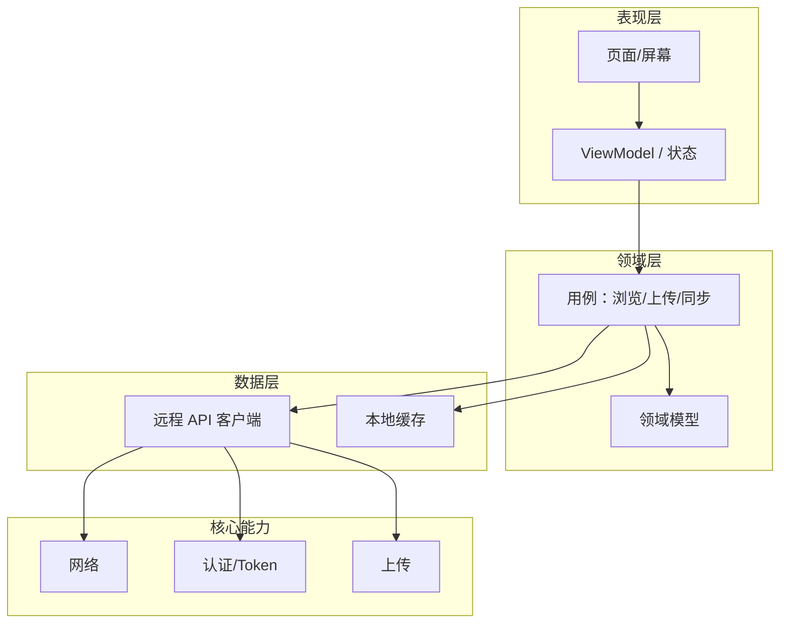

# 客户端架构设计

依据 [产品立项说明](./00_project_overview.md)：**客户端**作为资源**使用端**，支持**上传资源**与**多端访问、同步**。不承担资源识别、分类、整理逻辑，该部分由服务端完成。

---

## 系统模块结构图

---

## 模块说明

| 模块 | 职责 |
|------|------|
| **页面/屏幕** | 资源库列表、详情、阅读/播放、上传入口、设置等 UI |
| **ViewModel** | 界面状态、用户操作、调用用例，不直接访问网络 |
| **用例** | 获取资源列表、资源详情、上传文件、同步进度等业务编排 |
| **领域模型** | 资源、元数据、用户等与 UI、API 解耦的模型 |
| **远程 API 客户端** | 调用服务端 REST/WebSocket，封装请求与错误 |
| **本地缓存** | 列表/详情缓存、离线可读、同步元数据等 |
| **网络** | HTTP 客户端、重试、超时 |
| **认证** | Token 存储、刷新、请求头附加 |
| **上传** | 分片、断点续传、进度回调 |

---

## 技术选型

| 类别 | 选型 | 说明 |
|------|------|------|
| **跨平台** | Kotlin Multiplatform (KMP) | 共享业务逻辑与部分 UI（Android / iOS / Desktop / Web） |
| **UI** | Compose Multiplatform | Android / Desktop / Web 共用 UI；iOS 可用 Compose 或 UIKit 适配 |
| **架构** | 分层（表现 / 领域 / 数据）+ 单向数据流 | ViewModel 驱动 UI，用例驱动数据 |
| **网络** | Ktor Client | 与 KMP 一致，支持多平台 |
| **本地存储** | SQLDelight 或 DataStore + 缓存策略 | 列表/详情缓存、用户偏好 |
| **依赖注入** | Koin | 轻量，KMP 友好 |
| **鸿蒙** | 独立工程，ArkTS + ArkUI | 与 KMP 共享 API 契约与部分设计，不共享代码 |

---

## 与服务端、后台的边界

- **对服务端**：仅通过 API 上传、拉取资源与元数据、同步状态；不做识别/分类/整理。
- **对后台**：无直接通信；用户通过浏览器访问 Web 后台，后台再调用服务端配置 API。

---

**最后更新**：2026-01-30 · 版本 1.0.0
