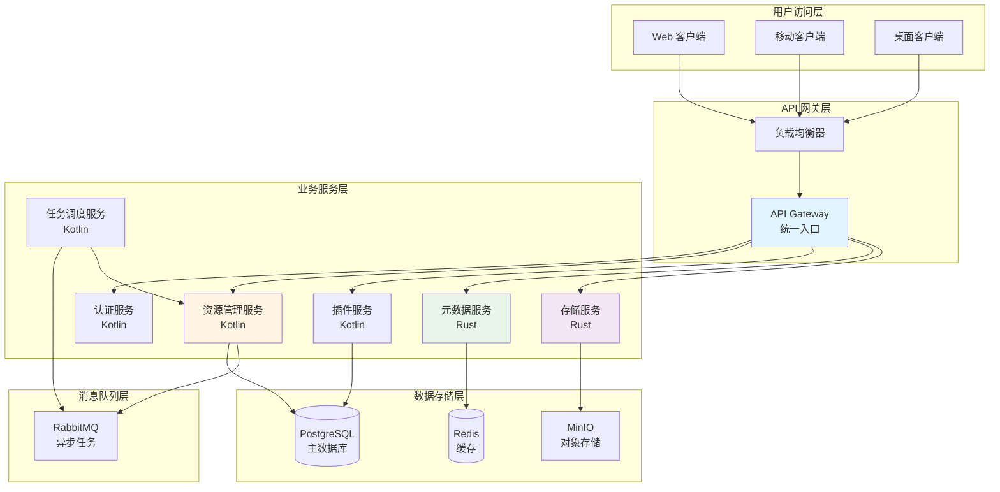
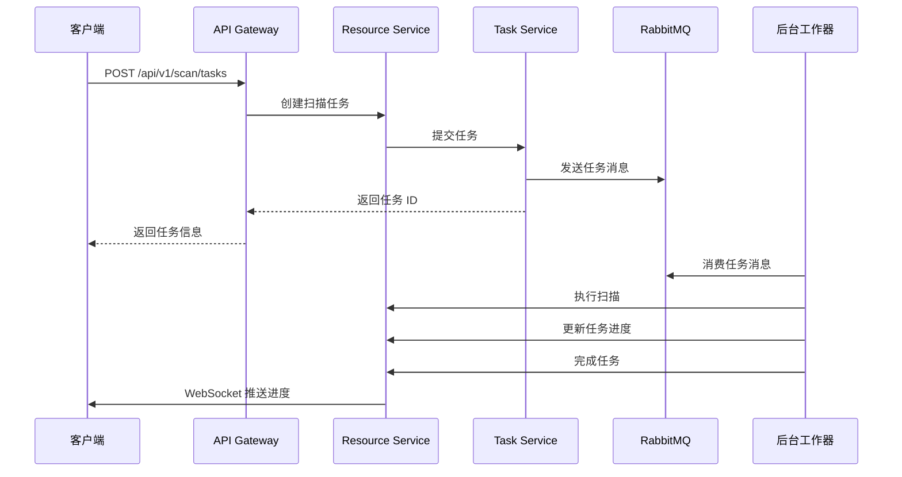
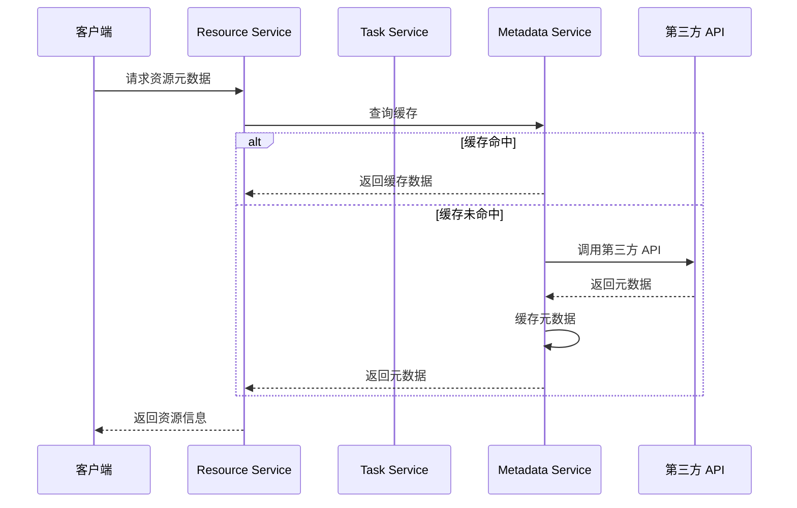

# 服务端设计方案

## 服务端架构概览

---

## 服务职责划分

### 1. API Gateway（API 网关）

**职责**：
- 统一 API 入口
- 请求路由和转发
- 认证和授权验证
- 限流和熔断
- 请求日志记录

**技术选型**：Kotlin + Ktor

**关键功能**：
- JWT Token 验证
- API 版本管理
- 请求转发到对应服务
- 统一错误处理

---

### 2. 认证服务（Auth Service）

**职责**：
- 用户注册和登录
- Token 生成和验证
- 用户信息管理
- 权限管理（RBAC）

**数据存储**：PostgreSQL

**关键功能**：
- 用户名/邮箱注册
- 密码加密存储
- JWT Token 签发
- 刷新 Token 机制
- 角色和权限管理

---

### 3. 资源管理服务（Resource Service）

**职责**：
- 资源 CRUD 操作
- 资源搜索和筛选
- 资源分类管理
- 资源统计

**数据存储**：PostgreSQL

**关键功能**：
- 资源创建、更新、删除
- 资源列表查询（分页、排序、筛选）
- 资源详情查询
- 资源统计（总数、类型分布等）
- 资源关联关系管理

---

### 4. 插件服务（Plugin Service）

**职责**：
- 插件安装和卸载
- 插件配置管理
- 插件执行调度
- 插件状态监控

**数据存储**：PostgreSQL + 文件系统

**关键功能**：
- 插件上传和验证
- 插件元数据管理
- 插件配置存储
- 插件执行任务创建
- 插件日志记录

---

### 5. 元数据服务（Metadata Service）

**职责**：
- 元数据刮削任务管理
- 元数据缓存
- 多数据源聚合
- 元数据质量评估

**数据存储**：Redis（缓存）+ PostgreSQL（持久化）

**技术选型**：Rust（高性能）

**关键功能**：
- 调用第三方 API（TMDB、MusicBrainz 等）
- 元数据去重和合并
- 元数据缓存策略
- 元数据质量评分

---

### 6. 存储服务（Storage Service）

**职责**：
- 文件上传和下载
- 文件存储管理
- 文件访问控制
- 存储空间管理

**数据存储**：MinIO / S3 兼容存储

**技术选型**：Rust（高性能 I/O）

**关键功能**：
- 文件上传（分片上传）
- 文件下载（断点续传）
- 文件删除
- 存储配额管理
- 文件访问权限控制

---

### 7. 任务调度服务（Task Service）

**职责**：
- 扫描任务调度
- 元数据刮削任务调度
- 任务状态管理
- 任务结果通知

**消息队列**：RabbitMQ

**关键功能**：
- 任务创建和调度
- 任务优先级管理
- 任务重试机制
- 任务进度推送（WebSocket）
- 任务结果通知

---

## 数据流设计

### 资源扫描流程

### 元数据刮削流程

---

## API 设计原则

### RESTful API 规范

1. **资源命名**：使用名词，复数形式
   - `/api/v1/resources`
   - `/api/v1/plugins`

2. **HTTP 方法**：
   - GET：查询
   - POST：创建
   - PUT：完整更新
   - PATCH：部分更新
   - DELETE：删除

3. **状态码**：
   - 200：成功
   - 201：创建成功
   - 400：请求错误
   - 401：未认证
   - 403：无权限
   - 404：资源不存在
   - 500：服务器错误

4. **分页**：
   - `?page=1&size=20`
   - 返回总数和分页信息

5. **筛选和排序**：
   - `?type=comic&sort=title&order=asc`

---

## Web 后台管理界面

### 功能模块

1. **仪表盘**
   - 资源统计概览
   - 系统状态监控
   - 最近活动

2. **资源管理**
   - 资源列表
   - 资源详情
   - 资源编辑
   - 批量操作

3. **扫描任务**
   - 任务列表
   - 任务详情
   - 任务创建
   - 任务监控

4. **插件管理**
   - 插件列表
   - 插件安装
   - 插件配置
   - 插件日志

5. **规则管理**
   - 规则列表
   - 规则创建
   - 规则编辑
   - 规则测试

6. **用户管理**
   - 用户列表
   - 角色管理
   - 权限配置

7. **系统设置**
   - 存储配置
   - API 配置
   - 通知配置

### 技术选型

- **前端框架**：React / Vue 3
- **UI 组件库**：Ant Design / Element Plus
- **状态管理**：Redux / Pinia
- **构建工具**：Vite
- **API 客户端**：Axios

---

## 部署方案

### Docker Compose 部署

**优势**：
- 一键部署
- 环境隔离
- 易于扩展
- 配置管理

**服务容器**：
- API Gateway
- Auth Service
- Resource Service
- Plugin Service
- Metadata Service
- Storage Service
- Task Service
- PostgreSQL
- Redis
- RabbitMQ
- MinIO
- Web Admin

### Kubernetes 部署（可选）

**适用场景**：
- 大规模部署
- 高可用要求
- 自动扩缩容

**组件**：
- Deployment（服务部署）
- Service（服务发现）
- Ingress（入口管理）
- ConfigMap（配置管理）
- Secret（密钥管理）
- PersistentVolume（数据持久化）

---

## 安全设计

### 认证机制

1. **JWT Token**
   - Access Token（短期，15分钟）
   - Refresh Token（长期，7天）
   - Token 刷新机制

2. **API Key**
   - 服务端访问使用
   - 限制访问范围
   - 定期轮换

### 授权机制

1. **RBAC（角色权限控制）**
   - 角色定义（Admin、User、Guest）
   - 权限定义（资源 CRUD、插件管理、系统设置）
   - 角色-权限关联

2. **资源级权限**
   - 资源所有者权限
   - 共享资源权限
   - 公开资源权限

### 数据安全

1. **传输加密**
   - HTTPS/TLS
   - WebSocket Secure (WSS)

2. **存储加密**
   - 敏感数据加密存储
   - 数据库连接加密

3. **访问控制**
   - 文件访问权限验证
   - IP 白名单（可选）

---

## 性能优化

### 缓存策略

1. **Redis 缓存**
   - 热点数据缓存
   - 元数据缓存
   - 会话缓存

2. **缓存更新**
   - 主动更新（数据变更时）
   - 被动更新（缓存过期时）
   - 缓存预热

### 数据库优化

1. **索引优化**
   - 常用查询字段建立索引
   - 复合索引优化

2. **查询优化**
   - 避免 N+1 查询
   - 使用连接查询替代子查询
   - 分页查询优化

3. **读写分离**（可选）
   - 主库写操作
   - 从库读操作

### 异步处理

1. **消息队列**
   - 耗时任务异步处理
   - 任务优先级管理
   - 任务重试机制

2. **后台任务**
   - 扫描任务后台执行
   - 元数据刮削后台执行
   - 定期清理任务

---

## 监控和日志

### 监控指标

1. **系统指标**
   - CPU 使用率
   - 内存使用率
   - 磁盘使用率
   - 网络流量

2. **应用指标**
   - API 响应时间
   - 错误率
   - 请求量
   - 任务执行情况

3. **业务指标**
   - 资源数量
   - 用户数量
   - 任务完成率
   - 插件使用情况

### 日志管理

1. **日志级别**
   - DEBUG：调试信息
   - INFO：一般信息
   - WARN：警告信息
   - ERROR：错误信息

2. **日志存储**
   - 文件日志
   - 集中式日志（ELK Stack）

3. **日志分析**
   - 错误日志分析
   - 性能日志分析
   - 用户行为分析

---

## 扩展性设计

### 水平扩展

1. **无状态服务**
   - 所有服务设计为无状态
   - 支持多实例部署

2. **负载均衡**
   - API Gateway 负载均衡
   - 服务实例负载均衡

3. **数据分片**（可选）
   - 数据库分片
   - 存储分片

### 垂直扩展

1. **资源扩容**
   - CPU 扩容
   - 内存扩容
   - 存储扩容

2. **服务拆分**
   - 按功能拆分服务
   - 按资源类型拆分服务

---

## 容灾和备份

### 数据备份

1. **数据库备份**
   - 定期全量备份
   - 增量备份
   - 备份验证

2. **文件备份**
   - 对象存储备份
   - 异地备份

### 容灾方案

1. **高可用部署**
   - 多实例部署
   - 自动故障转移

2. **数据恢复**
   - 备份恢复流程
   - 灾难恢复演练

---

**状态**：未评审 (unreview)  
**最后更新**：2026-01-27 · 版本 1.0.0
