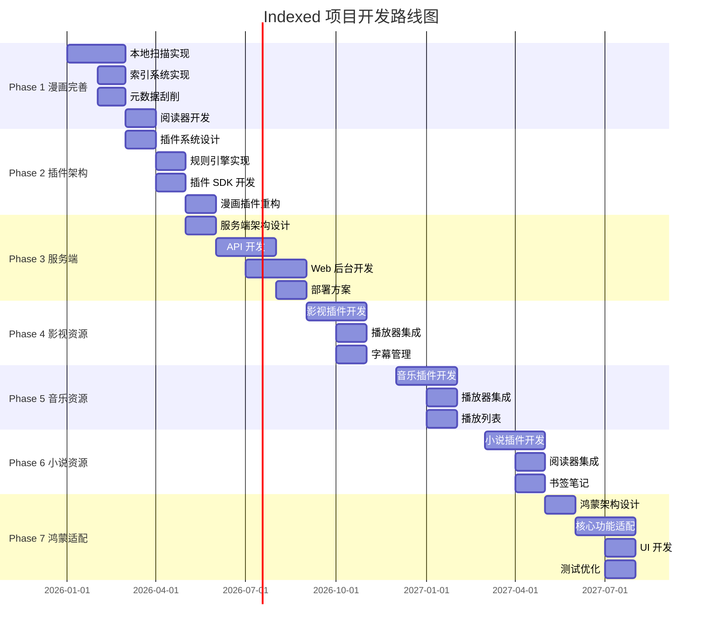

# 实施路线图

## 总体时间线

---

## Phase 1: 漫画资源完善（当前 - 3个月）

### 目标
完善现有漫画资源管理功能，建立完整的工作流程。

### 关键里程碑

**M1.1: 本地扫描实现**（1个月）
- [ ] 实现 LocalScanner（Android/iOS）
- [ ] 实现文件系统遍历
- [ ] 实现漫画/章节/页面识别
- [ ] 实现增量扫描
- [ ] 单元测试

**M1.2: 索引系统实现**（1个月）
- [ ] SQLDelight 数据库设计
- [ ] 实现 IndexUpdateManager
- [ ] 实现增删改检测
- [ ] 实现批量更新
- [ ] 性能优化

**M1.3: 元数据刮削**（1个月）
- [ ] 实现 LocalScrapeQueue
- [ ] 集成 MyAnimeList API
- [ ] 实现元数据解析
- [ ] 实现重试机制
- [ ] 缓存策略

**M1.4: 阅读器开发**（1个月）
- [ ] 图片查看器组件
- [ ] 翻页动画
- [ ] 缩放和滚动
- [ ] 阅读设置
- [ ] 阅读进度保存

### 交付物
- 完整的本地漫画扫描功能
- 索引和缓存系统
- 元数据刮削功能
- 基础阅读器

---

## Phase 2: 插件化架构设计（3-6个月）

### 目标
设计并实现可扩展的资源整理插件系统。

### 关键里程碑

**M2.1: 插件系统设计**（1个月）
- [ ] 插件接口定义
- [ ] 插件管理器设计
- [ ] 插件加载机制设计
- [ ] 插件配置管理设计
- [ ] 架构文档

**M2.2: 规则引擎实现**（1个月）
- [ ] 规则定义和解析
- [ ] 规则执行引擎
- [ ] 规则链管理
- [ ] 规则验证
- [ ] 规则模板系统

**M2.3: 插件 SDK 开发**（1个月）
- [ ] 插件开发 SDK
- [ ] 开发工具和模板
- [ ] 调试工具
- [ ] 文档和示例
- [ ] 测试框架

**M2.4: 漫画插件重构**（1个月）
- [ ] 将现有漫画功能重构为插件
- [ ] 实现漫画资源插件
- [ ] 实现漫画规则插件
- [ ] 实现漫画元数据插件
- [ ] 插件测试

### 交付物
- 插件化架构文档
- 插件开发 SDK
- 规则引擎
- 漫画资源插件（示例）

---

## Phase 3: 服务端开发（6-9个月）

### 目标
开发可私有化部署的资源管理服务。

### 关键里程碑

**M3.1: 服务端架构设计**（1个月）
- [ ] 微服务架构设计
- [ ] API 设计
- [ ] 数据库设计
- [ ] 部署方案设计
- [ ] 安全方案设计

**M3.2: API 开发**（2个月）
- [ ] API Gateway 实现
- [ ] 认证服务实现
- [ ] 资源管理服务实现
- [ ] 插件服务实现
- [ ] 元数据服务实现（Rust）
- [ ] 存储服务实现（Rust）
- [ ] 任务调度服务实现

**M3.3: Web 后台开发**（2个月）
- [ ] 前端框架搭建
- [ ] 仪表盘页面
- [ ] 资源管理页面
- [ ] 扫描任务页面
- [ ] 插件管理页面
- [ ] 规则管理页面
- [ ] 用户管理页面
- [ ] 系统设置页面

**M3.4: 部署方案**（1个月）
- [ ] Docker Compose 配置
- [ ] 部署文档
- [ ] 运维文档
- [ ] 监控方案
- [ ] 备份方案

### 交付物
- 可私有化部署的服务端
- Web 后台管理界面
- Docker 镜像和部署文档

---

## Phase 4: 影视资源支持（9-12个月）

### 目标
扩展支持影视作品资源。

### 关键里程碑

**M4.1: 影视插件开发**（2个月）
- [ ] 视频文件识别
- [ ] 视频信息解析
- [ ] 文件夹结构识别
- [ ] 剧集管理
- [ ] 视频资源插件实现

**M4.2: 播放器集成**（1个月）
- [ ] 视频播放器组件
- [ ] 播放控制
- [ ] 播放进度管理
- [ ] 播放历史

**M4.3: 字幕管理**（1个月）
- [ ] 字幕文件识别
- [ ] 字幕解析
- [ ] 字幕显示
- [ ] 字幕下载（可选）

### 交付物
- 影视资源管理功能
- 视频播放器
- 字幕管理功能

---

## Phase 5: 音乐资源支持（12-15个月）

### 目标
扩展支持音乐资源。

### 关键里程碑

**M5.1: 音乐插件开发**（2个月）
- [ ] 音频文件识别
- [ ] ID3 标签解析
- [ ] 专辑结构识别
- [ ] 音乐资源插件实现

**M5.2: 播放器集成**（1个月）
- [ ] 音频播放器组件
- [ ] 播放控制
- [ ] 专辑封面显示
- [ ] 播放历史

**M5.3: 播放列表**（1个月）
- [ ] 播放列表管理
- [ ] 播放列表编辑
- [ ] 播放列表分享（可选）

### 交付物
- 音乐资源管理功能
- 音频播放器
- 播放列表管理

---

## Phase 6: 小说资源支持（15-18个月）

### 目标
扩展支持小说资源。

### 关键里程碑

**M6.1: 小说插件开发**（2个月）
- [ ] 电子书文件识别
- [ ] EPUB/MOBI 解析
- [ ] 文本文件解析
- [ ] 小说资源插件实现

**M6.2: 阅读器集成**（1个月）
- [ ] 文本阅读器组件
- [ ] 阅读控制
- [ ] 目录导航
- [ ] 字体和主题

**M6.3: 书签笔记**（1个月）
- [ ] 书签管理
- [ ] 笔记功能
- [ ] 阅读进度同步

### 交付物
- 小说资源管理功能
- 电子书阅读器
- 书签和笔记功能

---

## Phase 7: 鸿蒙平台适配（18-21个月）

### 目标
开发鸿蒙原生应用。

### 关键里程碑

**M7.1: 鸿蒙架构设计**（1个月）
- [ ] 项目架构设计
- [ ] 技术选型
- [ ] 开发环境搭建
- [ ] 架构文档

**M7.2: 核心功能适配**（2个月）
- [ ] 核心业务逻辑适配
- [ ] 数据层适配
- [ ] 网络层适配
- [ ] 本地存储适配

**M7.3: UI 开发**（1个月）
- [ ] UI 界面开发（ArkUI）
- [ ] 导航设计
- [ ] 主题适配
- [ ] 交互优化

**M7.4: 测试优化**（1个月）
- [ ] 功能测试
- [ ] 性能测试
- [ ] 兼容性测试
- [ ] 优化和修复

### 交付物
- 鸿蒙原生应用
- 鸿蒙平台文档

---

## 资源分配建议

### 团队规模

**Phase 1-2**（6个月）：
- 2-3 名客户端开发
- 1 名架构师

**Phase 3**（3个月）：
- 2 名服务端开发（Kotlin）
- 1 名服务端开发（Rust）
- 1 名前端开发
- 1 名 DevOps

**Phase 4-6**（9个月）：
- 2-3 名客户端开发
- 1 名服务端开发
- 1 名测试

**Phase 7**（3个月）：
- 1-2 名鸿蒙开发
- 1 名测试

---

## 风险管控

### 技术风险

1. **跨平台兼容性**
   - 风险：不同平台限制导致功能差异
   - 应对：提前调研，设计抽象层

2. **性能问题**
   - 风险：大规模资源管理性能不足
   - 应对：性能测试，优化方案

3. **插件安全**
   - 风险：动态加载插件存在安全风险
   - 应对：沙箱机制，代码审核

### 进度风险

1. **需求变更**
   - 风险：需求频繁变更影响进度
   - 应对：敏捷开发，迭代交付

2. **技术难点**
   - 风险：遇到技术难点导致延期
   - 应对：技术预研，备选方案

---

## 质量保证

### 测试策略

1. **单元测试**：核心逻辑单元测试覆盖率 > 80%
2. **集成测试**：关键流程集成测试
3. **端到端测试**：主要功能端到端测试
4. **性能测试**：关键性能指标测试
5. **兼容性测试**：多平台兼容性测试

### 代码质量

1. **代码审查**：所有代码必须经过审查
2. **静态分析**：使用工具进行静态分析
3. **文档完善**：关键功能必须有文档
4. **重构优化**：定期重构优化代码

---

## 成功标准

### 功能标准
- 支持 4 种资源类型
- 支持 5 个客户端平台
- 插件系统支持 10+ 插件
- 服务端支持 10万+ 资源管理

### 性能标准
- 资源扫描速度 < 1分钟/GB
- 应用启动时间 < 2秒
- 界面响应时间 < 100ms
- API 响应时间 < 500ms

### 质量标准
- 单元测试覆盖率 > 80%
- 崩溃率 < 0.1%
- 用户满意度 > 4.5/5

---

**状态**：未评审 (unreview)  
**最后更新**：2026-01-27 · 版本 1.0.0
