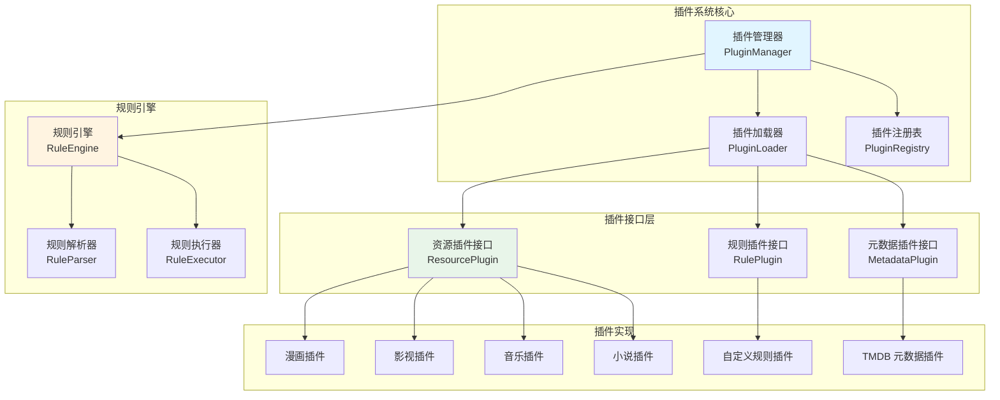
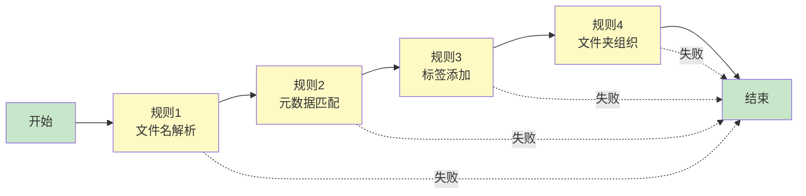
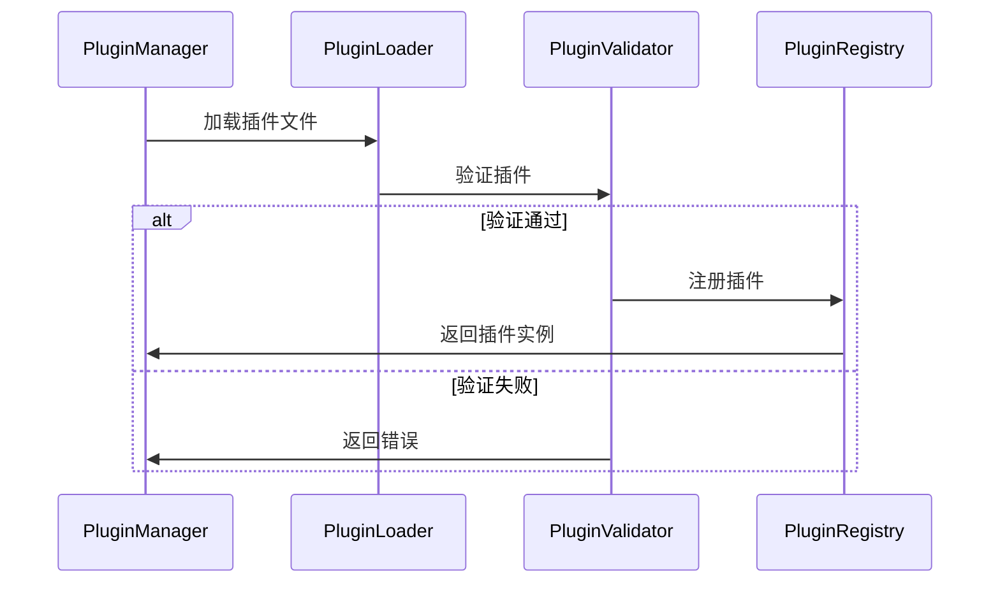
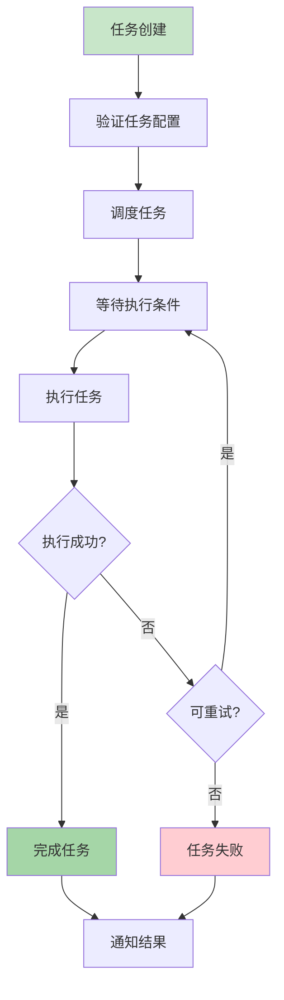

# 插件系统设计方案

## 插件系统架构



---

## 插件类型

### 1. 资源插件（Resource Plugin）

**职责**：
- 识别特定类型的资源文件
- 扫描文件系统
- 解析资源结构
- 验证文件格式

**实现示例**：
- 漫画插件：识别图片文件夹、CBZ、CBR
- 影视插件：识别视频文件（MP4、MKV 等）
- 音乐插件：识别音频文件（MP3、FLAC 等）
- 小说插件：识别电子书文件（EPUB、TXT 等）

---

### 2. 规则插件（Rule Plugin）

**职责**：
- 定义资源整理规则
- 执行规则逻辑
- 验证规则有效性

**规则类型**：
- **文件名规则**：根据文件名提取信息
- **文件夹结构规则**：根据文件夹结构组织资源
- **元数据规则**：根据元数据分类和标签
- **重命名规则**：自动重命名文件
- **移动规则**：自动移动文件到指定位置
- **标签规则**：自动添加标签

---

### 3. 元数据插件（Metadata Plugin）

**职责**：
- 从第三方 API 获取元数据
- 解析本地元数据文件
- 合并多个数据源的元数据

**数据源示例**：
- **漫画**：MyAnimeList、AniList、Kitsu
- **影视**：TMDB、豆瓣、IMDb
- **音乐**：MusicBrainz、Last.fm、Discogs
- **小说**：Goodreads、豆瓣读书

---

## 插件接口设计

### 资源插件接口

**核心方法**：
1. `getResourceType()` - 返回资源类型
2. `scanFiles()` - 扫描文件系统
3. `parseMetadata()` - 解析元数据
4. `validateFile()` - 验证文件格式
5. `getSupportedExtensions()` - 返回支持的文件扩展名

**扩展方法**：
- `getDefaultScanConfig()` - 获取默认扫描配置
- `getRuleTemplates()` - 获取规则模板
- `getMetadataSources()` - 获取元数据源列表

---

### 规则插件接口

**核心方法**：
1. `getRuleType()` - 返回规则类型
2. `execute()` - 执行规则
3. `validate()` - 验证规则配置
4. `getConfigSchema()` - 返回配置模式

**规则执行上下文**：
- 资源信息
- 文件信息
- 元数据信息
- 配置信息

---

### 元数据插件接口

**核心方法**：
1. `getSourceName()` - 返回数据源名称
2. `search()` - 搜索资源
3. `getMetadata()` - 获取元数据
4. `getSupportedResourceTypes()` - 返回支持的资源类型

**扩展方法**：
- `getApiKey()` - 获取 API Key（如果需要）
- `getRateLimit()` - 获取速率限制
- `getCachePolicy()` - 获取缓存策略

---

## 规则引擎设计

### 规则定义

**规则结构**：
- 规则 ID
- 规则名称
- 规则类型
- 规则配置
- 执行优先级
- 启用状态

**规则配置示例**：

```json
{
  "id": "comic-filename-rule",
  "name": "漫画文件名规则",
  "type": "filename",
  "resourceType": "comic",
  "config": {
    "pattern": "^(.*?)\\s*-\s*(.*?)$",
    "extractGroups": [1, 2],
    "targetFormat": "{title} - {chapter}"
  },
  "priority": 100,
  "enabled": true
}
```

---

### 规则链执行



**执行策略**：
- **顺序执行**：按优先级顺序执行
- **条件执行**：根据条件决定是否执行
- **并行执行**：无依赖的规则并行执行
- **失败处理**：继续执行或中断执行

---

## 插件生命周期

### 插件加载流程



### 插件状态

1. **未加载**：插件文件存在但未加载
2. **已加载**：插件已加载到内存
3. **已注册**：插件已注册到注册表
4. **运行中**：插件正在执行任务
5. **已禁用**：插件被禁用
6. **错误**：插件加载或执行出错

---

## 插件配置管理

### 配置结构

**插件配置**：
- 插件 ID
- 插件版本
- 插件设置
- 规则配置
- 元数据源配置

**配置存储**：
- 数据库存储（PostgreSQL）
- 配置文件存储（JSON/YAML）
- 环境变量（敏感配置）

### 配置验证

1. **模式验证**：根据配置模式验证
2. **值验证**：验证配置值的有效性
3. **依赖验证**：验证依赖配置是否完整

---

## 插件开发流程

### 1. 插件开发

**步骤**：
1. 实现插件接口
2. 编写插件逻辑
3. 编写单元测试
4. 编写文档

**开发工具**：
- 插件 SDK
- 开发模板
- 调试工具
- 测试框架

---

### 2. 插件打包

**包结构**：
```
plugin-name/
├── plugin.json          # 插件元数据
├── plugin.jar           # 插件代码
├── config.schema.json   # 配置模式
├── README.md            # 插件文档
└── icon.png             # 插件图标
```

**插件元数据**：
```json
{
  "id": "comic-plugin",
  "name": "漫画资源插件",
  "version": "1.0.0",
  "description": "支持漫画资源扫描和管理",
  "author": "Indexed Team",
  "resourceTypes": ["comic"],
  "dependencies": [],
  "configSchema": "config.schema.json"
}
```

---

### 3. 插件安装

**安装方式**：
1. **本地安装**：上传插件文件
2. **远程安装**：从插件市场安装
3. **开发模式**：直接加载开发中的插件

**安装流程**：
1. 验证插件文件
2. 检查依赖
3. 加载插件
4. 注册插件
5. 初始化配置

---

### 4. 插件更新

**更新策略**：
- **版本检查**：检查是否有新版本
- **兼容性检查**：检查版本兼容性
- **平滑更新**：支持不停机更新
- **回滚机制**：支持版本回滚

---

## 插件市场

### 功能设计

1. **插件浏览**
   - 插件分类
   - 插件搜索
   - 插件排序

2. **插件详情**
   - 插件介绍
   - 使用文档
   - 用户评价
   - 版本历史

3. **插件安装**
   - 一键安装
   - 依赖检查
   - 配置向导

4. **插件管理**
   - 已安装插件列表
   - 插件更新
   - 插件卸载

---

### 插件审核

**审核标准**：
- 代码安全性
- 功能完整性
- 文档完整性
- 性能要求
- 兼容性要求

**审核流程**：
1. 提交审核
2. 自动检查
3. 人工审核
4. 发布或拒绝

---

## 任务编排

### 任务定义

**任务类型**：
- **扫描任务**：扫描文件系统
- **整理任务**：执行规则整理资源
- **元数据任务**：获取元数据
- **转换任务**：资源格式转换

**任务配置**：
- 任务名称
- 任务类型
- 执行计划（一次性/周期性）
- 执行条件
- 失败重试策略

---

### 任务编排流程



---

### 任务依赖

**依赖类型**：
- **前置任务**：必须完成前置任务
- **资源依赖**：依赖特定资源
- **时间依赖**：特定时间执行

**依赖解析**：
- 构建任务依赖图
- 检测循环依赖
- 优化执行顺序

---

## 性能考虑

### 插件性能优化

1. **懒加载**：按需加载插件
2. **缓存机制**：缓存插件实例
3. **并行执行**：支持并行执行插件
4. **资源限制**：限制插件资源使用

### 规则引擎性能优化

1. **规则索引**：建立规则索引
2. **规则缓存**：缓存规则执行结果
3. **批量处理**：批量执行规则
4. **异步执行**：异步执行耗时规则

---

## 安全性设计

### 插件安全

1. **沙箱机制**：插件运行在沙箱中
2. **权限控制**：限制插件权限
3. **代码签名**：验证插件签名
4. **安全审计**：记录插件操作

### 规则安全

1. **规则验证**：验证规则安全性
2. **操作限制**：限制危险操作
3. **备份机制**：执行前备份数据
4. **回滚机制**：支持操作回滚

---

## 扩展性设计

### 插件扩展点

1. **资源识别扩展**：自定义资源识别逻辑
2. **规则扩展**：自定义规则类型
3. **元数据源扩展**：添加新的元数据源
4. **UI 扩展**：自定义 UI 组件

### 插件通信

1. **事件机制**：插件间事件通信
2. **服务发现**：插件服务发现
3. **数据共享**：插件数据共享机制

---

**状态**：未评审 (unreview)  
**最后更新**：2026-01-27 · 版本 1.0.0
